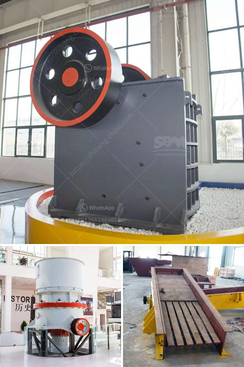

<h3>cement making machines for factory</h3>
Cement, one of the most essential building materials, has been used for centuries to construct structures that stand the test of time. The process of cement making involves several steps, and today, advanced cement making machines play a pivotal role in ensuring efficiency and productivity in cement factories.

In a cement manufacturing plant, various raw materials such as limestone, clay, iron ore, and gypsum are required. These raw materials are crushed, powdered, and mixed in the right proportions to obtain a homogeneous mixture called the raw meal. The next crucial step is the clinker production, where the raw meal is heated in a rotary kiln at a very high temperature. This process results in the formation of nodules known as clinker.

To facilitate the above processes, a cement factory needs reliable and efficient cement making machines. Let's explore some of the key machines commonly used in cement manufacturing plants.

1. Crusher: The crusher is responsible for reducing the size of the raw materials to a manageable size. It can crush various materials, such as limestone, shale, and clay, and is an essential machine in the cement making process.

2. Grinding mill: Once the clinker is obtained, it needs to be ground into a fine powder. This is where the grinding mill comes into play. The grinding mill uses large rotating drums filled with steel balls to crush and grind the clinker into the desired particle size.

3. Kiln: The rotary kiln is the heart of the cement manufacturing process. It is a large cylinder inclined at a slight angle and rotates slowly to allow for thorough mixing and heat transfer. The raw meal is fed into one end of the kiln, and as it progresses through, it is heated to extreme temperatures, causing chemical reactions and the formation of clinker.

4. Cooler: Once the clinker is produced, it undergoes a cooling process to bring it to a manageable temperature. The cooler uses air or water to cool the clinker rapidly and prevent it from losing its desired properties.

5. Cement mill: After the clinker is cooled, it is ground into a fine powder in the cement mill. This machine pulverizes the clinker along with gypsum, and sometimes other additives like fly ash or slag, to produce cement with the desired chemical composition.

6. Packing machine: The final product, cement, needs to be properly packaged for transportation and storage. Packing machines weigh and fill cement into bags or bulk containers, ensuring accuracy and minimizing wastage.

It is worth mentioning that modern cement making machines are equipped with advanced technologies to ensure energy efficiency and environmental sustainability. For example, many machines are designed to recycle waste heat generated during the cement-making process, saving energy and reducing greenhouse gas emissions. Additionally, dedusting systems are integrated into these machines to control dust emissions, creating a safer and cleaner working environment.

In conclusion, cement making machines are crucial for the efficient production of cement in factories. From crushing raw materials to grinding clinker and packing cement, these machines enable the production of high-quality cement products. As technology continues to advance, these machines are becoming more efficient and eco-friendly, contributing to sustainable cement manufacturing.
<h3>Contact us</h3><ul><li><strong>Whatsapp:&nbsp;<a href="https://wa.me/8613661969651">+8613661969651</a></strong></li><li><a href="https://swt.shibang-china.com/?git&amp;zhl&amp;cement making machines for factory"><strong>Online Service(chat now)</strong></a></li></ul><h3>Related</h3><ul><li><a href='dry grinding ball mills for lime.md'>dry grinding ball mills for lime</a></li><li><a href='difference between residual and transported soil.md'>difference between residual and transported soil</a></li><li><a href='ultrafine mill in china.md'>ultrafine mill in china</a></li><li><a href='what is the feed of jaw crusher.md'>what is the feed of jaw crusher</a></li><li><a href='granite and marble mining in uganda.md'>granite and marble mining in uganda</a></li></ul>