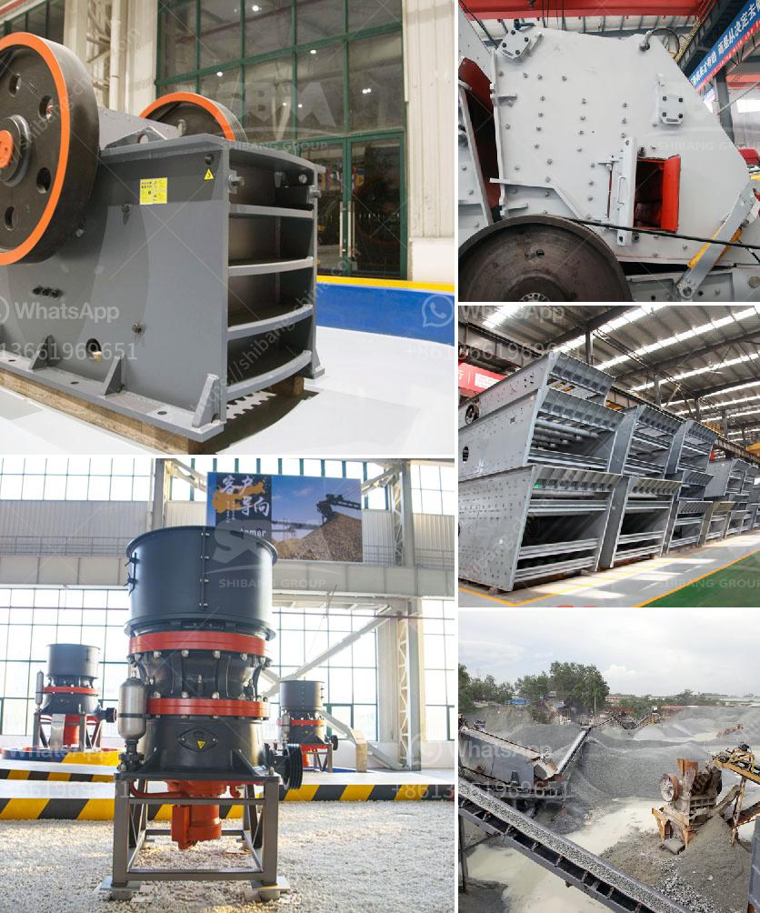

<h3>cement mill operation manual</h3>
Cement mill is the key equipment for grinding after the crushing process, which is widely used in the manufacturing industry, such as cement, silicate, new building material, refractory material, fertilizer, ferrous metal, nonferrous metal and glass ceramics. It can be used for dry and wet grinding of various ores and other materials.

The cement mill operation manual is a necessary work for the cement mill operator. It must know about the operation of the mill and be familiar with the relevant safety regulations. In order to ensure the smooth production of the mill and reduce the harm to the body, it must be installed on the appropriate seat and vertical with the level. The foundation shall not be loose, and the bolts shall be tightened firmly. In the process of installation, pay attention to the vertical spacing of the motor and the host, and make sure that the motor pulley and the host pulley are parallel to each other.

Before starting the cement mill, check whether the connecting bolts, gears, couplings and other important parts are in good condition. Ensure that all parts are lubricated well. Meanwhile, check the motor and the circuit connection to ensure that the equipment is in good working condition.

When starting the cement mill, the motor of the mill should be started first. Then start the analyzer, classifier, blower and other equipment. After the normal startup of the equipment, the cement mill can be started smoothly without noise and vibration.

In the process of daily maintenance, the cement mill should be lubricated regularly and the wearing parts should be replaced in time. If any abnormality is found, it should be stopped in time for inspection and troubleshooting to ensure the normal operation of the equipment.

In summary, the cement mill operation manual is brief in structure, which only needs a small amount of time for daily maintenance and repair, and it is a very useful and practical work. So, as long as you master the instructions of cement mill operation manual, you can complete the operation and maintenance of cement mill.
<h3>Contact us</h3><ul><li><strong>Whatsapp:&nbsp;<a href="https://wa.me/8613661969651">+8613661969651</a></strong></li><li><a href="https://swt.shibang-china.com/?git&amp;zhl&amp;cement mill operation manual"><strong>Online Service(chat now)</strong></a></li></ul><h3>Related</h3><ul><li><a href='micron limestone grinding unit in india.md'>micron limestone grinding unit in india</a></li><li><a href='aggregate roller crushing mill malaysia.md'>aggregate roller crushing mill malaysia</a></li><li><a href='crusher machine for hardened powder.md'>crusher machine for hardened powder</a></li><li><a href='ball mill 35 ton price.md'>ball mill 35 ton price</a></li><li><a href='brick crusher for sale.md'>brick crusher for sale</a></li></ul>