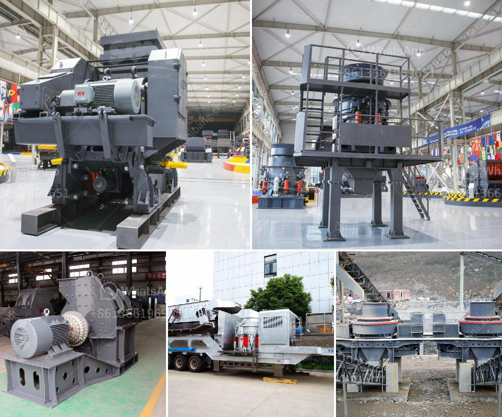

<h3>cement mills cement from the other</h3>
Cement is one of the most widely used construction materials in the world, serving as the backbone of numerous infrastructure projects. It is a crucial component for creating strong and durable structures such as buildings, bridges, dams, and roads. Cement mills play a vital role in the cement production process by grinding cement clinker into fine particles, which are blended with other materials to produce cement.

Cement mills, also known as cement ball mills, are mainly used in the grinding stage of cement production. In the cement grinding process, raw materials are fed into the mill in a dry state, and they are ground and dried by the movement of the mill and the grinding media (usually steel balls). As the mill rotates, the grinding media crushes and grinds the raw materials, forming a fine powder called cement clinker.

The cement clinker is then mixed with small amounts of gypsum and other additives, such as slag or fly ash, to produce different types of cement with various properties. These additives enhance the cement's performance, such as improving workability, setting time, and strength. After the blending process, the resulting cement is stored in silos before being packaged or transported to construction sites.

The design of cement mills has evolved over time to optimize efficiency and reduce energy consumption. Modern cement mills are equipped with advanced technologies, such as high-efficiency separators, roller presses, and vertical roller mills, to improve grinding performance. These technologies help to produce finer and more uniform cement particles, leading to higher strength and better workability.

Furthermore, cement mills contribute to environmental sustainability by utilizing alternative fuels. Many cement plants use alternative fuels, such as biomass, waste tires, and even municipal solid waste, as a substitute for traditional fossil fuels. This not only reduces greenhouse gas emissions but also helps to manage waste and conserve natural resources.

However, the operation of cement mills presents several challenges. The grinding process generates a significant amount of heat, which must be dissipated to prevent the cement from overheating and losing its quality. Cooling systems are therefore crucial to maintain the optimum temperature inside the mill.

Another challenge is the wear and tear of the grinding media and liners inside the mill. The grinding media, usually made of steel balls, can slowly erode due to the continuous impact and friction during the grinding process. Regular maintenance and replacement of worn-out parts are necessary to ensure efficient operation and prevent disruptions in cement production.

In conclusion, cement mills are essential equipment in the cement production process, responsible for grinding the raw materials into fine particles. The resulting cement clinker is then blended with additives to produce different types of cement, contributing to the construction industry's growth and development. With the advancement of technology and the adoption of sustainable practices, cement mills are becoming more efficient, reducing environmental impact while meeting the increasing demand for cement worldwide.
<h3>Contact us</h3><ul><li><strong>Whatsapp:&nbsp;<a href="https://wa.me/8613661969651">+8613661969651</a></strong></li><li><a href="https://swt.shibang-china.com/?git&amp;zhl&amp;cement mills cement from the other"><strong>Online Service(chat now)</strong></a></li></ul><h3>Related</h3><ul><li><a href='jaw crusher price in china.md'>jaw crusher price in china</a></li><li><a href='price of jaw crusher germany.md'>price of jaw crusher germany</a></li><li><a href='rock stone milling machine.md'>rock stone milling machine</a></li><li><a href='limestone crusher cost.md'>limestone crusher cost</a></li><li><a href='quartz powder ball mill in tamilnadu.md'>quartz powder ball mill in tamilnadu</a></li></ul>