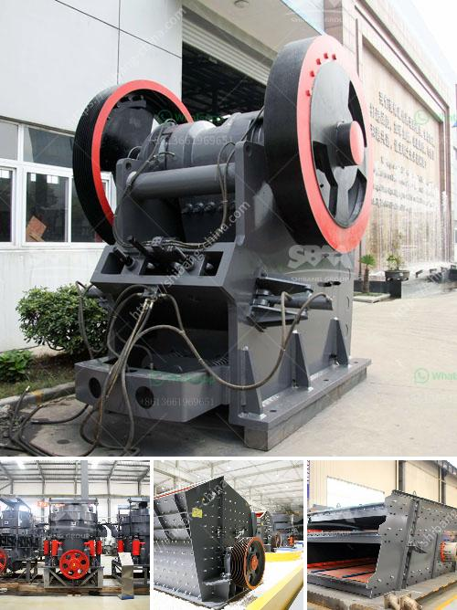

<h3>cement plant equipment catalogue pdf</h3>
Cement plants are industrial facilities that produce cement, a key ingredient in the construction industry. To efficiently produce high-quality cement, these plants require various equipment and machinery. A cement plant equipment catalogue PDF provides comprehensive information about the different types of machinery available for these plants.

The equipment catalogue typically contains detailed specifications and descriptions of various equipment used in cement plants. This can include crushers, kilns, ball mills, vertical roller mills, and other machinery used in cement production. Each equipment is designed to meet specific requirements in terms of capacity, power, and performance.

For instance, crushers are used to break down large rocks into smaller pieces, which are then fed into the next stage of the production process. Kilns are used to heat the raw materials at high temperatures to initiate chemical reactions that result in the production of cement clinker. Ball mills and vertical roller mills are used to grind and mix the raw materials to produce the desired cement composition.

Having access to a cement plant equipment catalogue PDF is beneficial for plant operators and engineers. It can help them understand the features and capabilities of different equipment options available in the market. The catalogue can also aid in the selection process, allowing them to compare different products and choose the most suitable equipment for their specific needs.

Furthermore, a catalog also provides information on the maintenance and operation of the equipment. This is crucial to ensure the longevity and optimal performance of the machinery. Maintenance instructions, troubleshooting tips, and safety guidelines are typically included to assist plant operators in maintaining and operating the equipment correctly.

In conclusion, a cement plant equipment catalogue PDF is a valuable resource for individuals involved in the cement industry. It provides comprehensive information about the various machinery used in cement plants, helping operators and engineers make informed decisions about equipment selection and maintenance. By using this catalogue as a reference, cement plants can optimize their operations, increase efficiency, and produce high-quality cement.
<h3>Contact us</h3><ul><li><strong>Whatsapp:&nbsp;<a href="https://wa.me/8613661969651">+8613661969651</a></strong></li><li><a href="https://swt.shibang-china.com/?git&amp;zhl&amp;cement plant equipment catalogue pdf"><strong>Online Service(chat now)</strong></a></li></ul><h3>Related</h3><ul><li><a href='ball mill for 15tphr capacity.md'>ball mill for 15tphr capacity</a></li><li><a href='crusher used for copper ore.md'>crusher used for copper ore</a></li><li><a href='portable silica sand washing machine.md'>portable silica sand washing machine</a></li><li><a href='coal crusher for sale in south africa.md'>coal crusher for sale in south africa</a></li><li><a href='aggregate crusher machine.md'>aggregate crusher machine</a></li></ul>