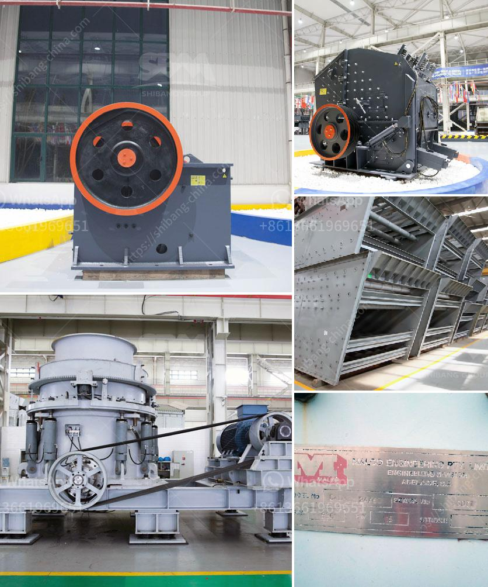

<h3>cement plant equipment from china</h3>
China has emerged as a leading global manufacturer and exporter of cement plant equipment. With its economic prowess, technological advancements, and skilled workforce, the country has become a preferred destination for industry players seeking reliable and cost-effective cement plant machinery. This article explores the reasons behind China's success in this sector and discusses some of the top cement plant equipment manufacturers in the country.

China's cement industry has experienced exponential growth in recent decades. This has necessitated the development and expansion of cement production facilities across the nation. To support this tremendous demand, Chinese manufacturers have rapidly advanced their capabilities in designing, manufacturing, and supplying cement plant equipment.

One of the primary reasons for China's competitiveness in this sector is its commitment to innovation and research and development (R&D). Chinese manufacturers invest heavily in technological advancements to improve the efficiency and performance of their equipment. By integrating cutting-edge technologies such as robotics, advanced sensor systems, and automation, Chinese cement plant equipment manufacturers have achieved significant breakthroughs in terms of productivity, energy efficiency, and environmental sustainability.

In addition to technological prowess, China's low production costs contribute to its dominance in the global cement plant equipment market. The country's manufacturing sector enjoys economies of scale due to its large domestic market and high production volumes. This enables Chinese manufacturers to offer competitive prices without compromising on the quality of their products. Furthermore, the availability of skilled labor at relatively low wages also helps in keeping production costs down.

Several Chinese companies have established themselves as market leaders in cement plant equipment manufacturing. One such company is Sinoma International Engineering Co., Ltd. This state-owned enterprise specializes in providing complete solutions for cement production, including design, engineering, procurement, construction, and project management. Sinoma has a strong presence both domestically and internationally, with projects spanning more than 100 countries.

Another major player in the Chinese cement plant equipment market is CITIC Heavy Industries Co., Ltd. This company offers a wide range of products, including ball mills, kilns, crushers, and vertical mills. CITIC aims to provide customized solutions to meet the specific needs of its clients.

Wangda Industrial Group Co., Ltd. is another renowned Chinese manufacturer of cement plant equipment. The company specializes in the production of brick-making machinery and equipment, which are essential for the construction and operation of cement plants.

With their commitment to quality, innovation, and cost-effectiveness, Chinese cement plant equipment manufacturers have gained the trust of global cement producers. Many international companies now rely on Chinese suppliers for their equipment needs, further solidifying China's position as a prominent player in the global cement plant equipment market.

In conclusion, China's success in cement plant equipment manufacturing can be attributed to its technological advancements, low production costs, and commitment to innovation. The country's manufacturers lead the industry in terms of quality, efficiency, and sustainability. As a result, Chinese cement plant equipment is in high demand worldwide, with numerous international companies relying on China for their equipment needs. As the country continues to invest in R&D and enhance its manufacturing capabilities, it is likely to maintain its position as a global leader in this sector for years to come.
<h3>Contact us</h3><ul><li><strong>Whatsapp:&nbsp;<a href="https://wa.me/8613661969651">+8613661969651</a></strong></li><li><a href="https://swt.shibang-china.com/?git&amp;zhl&amp;cement plant equipment from china"><strong>Online Service(chat now)</strong></a></li></ul><h3>Related</h3><ul><li><a href='biggest jaw crusher in the world.md'>biggest jaw crusher in the world</a></li><li><a href='price of jaw crusher in zimbabwe.md'>price of jaw crusher in zimbabwe</a></li><li><a href='egypt gypsum powder manufacturer.md'>egypt gypsum powder manufacturer</a></li><li><a href='ominer supplies namibia jaw crushers.md'>ominer supplies namibia jaw crushers</a></li><li><a href='best machine brands for quarry.md'>best machine brands for quarry</a></li></ul>