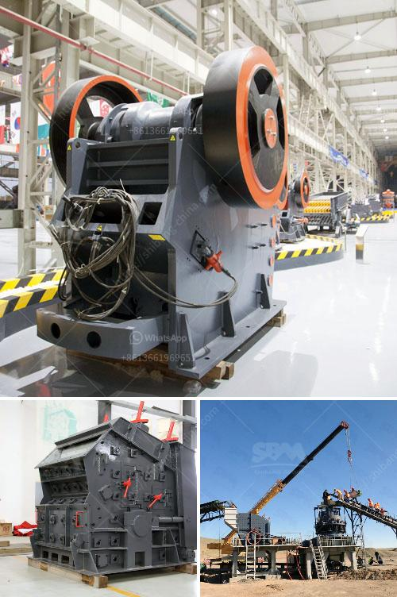

<h3>cement plant machinery manufacturers in coimbatore</h3>
The construction industry plays a pivotal role in the growth and development of any country. And at the heart of this industry lies the cement plant, a facility that manufactures cement, an essential building material used in various construction projects. Coimbatore, a bustling city located in the southern region of India, has emerged as a hub for cement plant machinery manufacturers, providing state-of-the-art equipment to aid in the production process.

Coimbatore's rise as a prominent manufacturing hub for cement plant machinery can be attributed to several factors. Its strategic location, well-connected transportation network, and availability of skilled labor have made it a preferred choice for setting up manufacturing units. Additionally, the government's support, through favorable policies and incentives, has encouraged investment in this sector.

One of the prominent manufacturers in Coimbatore is ABC Machinery Pvt. Ltd., renowned for its innovative and high-quality equipment. With years of experience in the industry, ABC Machinery has gained a strong reputation for delivering cutting-edge solutions tailored to meet the specific needs of cement plant operators. Their machinery includes crushers, mills, kilns, conveyors, and other equipment necessary for the production process.

The cement plant machinery manufactured in Coimbatore boasts advanced features and technologies that enhance efficiency, minimize energy consumption, and reduce environmental impact. These machines are designed to handle multiple tasks simultaneously, ensuring smooth operations and uninterrupted production. The use of automation and computerized systems further streamlines the manufacturing process, increasing productivity and ensuring uniform quality.

Apart from ABC Machinery, Coimbatore houses several other renowned cement plant machinery manufacturers, each offering a unique range of products and services. These manufacturers have contributed significantly to the country's cement production capacity, thereby fueling the construction industry's growth. The availability of multiple choices allows cement plant operators to select machinery that aligns with their operational requirements and budget.

In addition to manufacturing machinery, these companies provide comprehensive after-sales services, including installation, maintenance, and technical support. This ensures that cement plant operators can rely on continuous assistance, minimizing downtime and maximizing productivity. Moreover, regular servicing and maintenance increase the lifespan of the machinery, optimizing the return on investment for the operators.

Coimbatore's cement plant machinery manufacturers have also embraced sustainability by developing eco-friendly equipment. These machines are designed to reduce emissions and lower energy consumption, contributing to the industry's efforts to combat climate change. By using such environmentally-conscious machinery, cement plant operators can comply with stringent regulations and demonstrate their commitment to sustainable practices.

Furthermore, these manufacturers understand the importance of continuous innovation to stay ahead in a competitive market. They invest heavily in research and development, constantly striving to improve their machinery's performance, efficiency, and reliability. This dedication to innovation has positioned Coimbatore as a reliable source of technologically advanced cement plant machinery for both domestic and international markets.

In conclusion, Coimbatore has emerged as a hotbed for cement plant machinery manufacturers, catering to the ever-growing demands of the construction industry. These manufacturers offer a wide range of cutting-edge machinery, coupled with comprehensive after-sales services, and a focus on sustainability. With their expertise and commitment to innovation, Coimbatore's cement plant machinery manufacturers are revolutionizing the construction industry and propelling India's growth on the global stage.
<h3>Contact us</h3><ul><li><strong>Whatsapp:&nbsp;<a href="https://wa.me/8613661969651">+8613661969651</a></strong></li><li><a href="https://swt.shibang-china.com/?git&amp;zhl&amp;cement plant machinery manufacturers in coimbatore"><strong>Online Service(chat now)</strong></a></li></ul><h3>Related</h3><ul><li><a href='bauxite plant in dubai.md'>bauxite plant in dubai</a></li><li><a href='south africa manganese ore jaw crusher south africa.md'>south africa manganese ore jaw crusher south africa</a></li><li><a href='indonesia jaw crusher.md'>indonesia jaw crusher</a></li><li><a href='limestone impact crusher.md'>limestone impact crusher</a></li><li><a href='business plan for a quarry crusher.md'>business plan for a quarry crusher</a></li></ul>