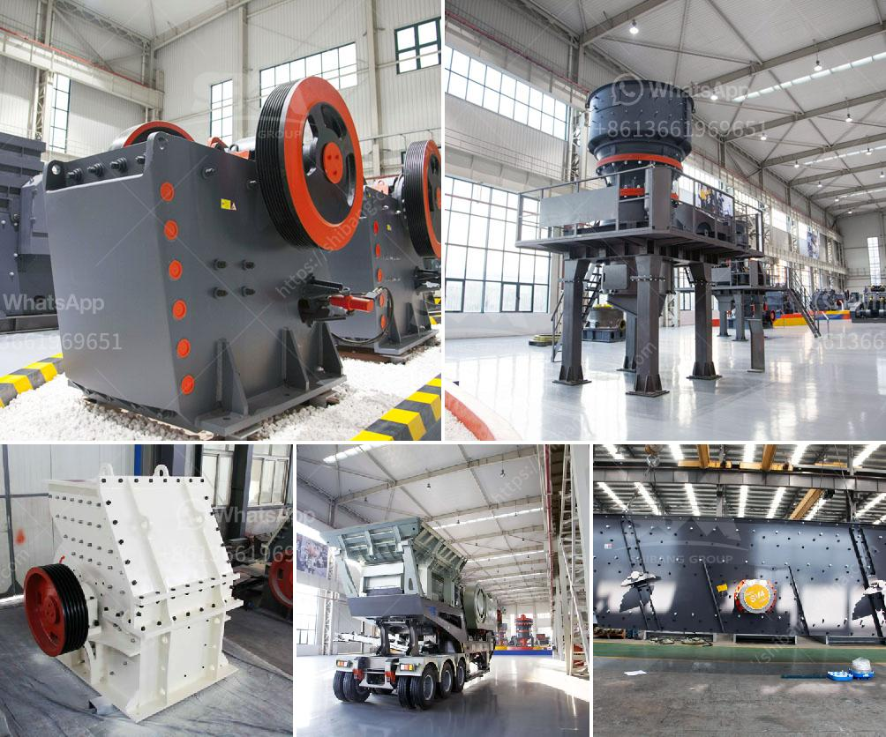

<h3>cement production plant</h3>
Cement is a crucial component in the construction industry, being the binding agent that holds concrete together. The demand for cement is ever-increasing, driven by the growth in infrastructure development and urbanization worldwide. A cement production plant plays a pivotal role in meeting this demand by producing high-quality cement efficiently.

A cement production plant is a complex facility that requires specialized machinery and advanced technology to carry out the various stages of cement production. The process begins with the extraction of limestone and other raw materials from quarries or mines. These raw materials are then crushed and ground into fine powder using crushers and ball mills.

The next step is the preheating and precalcination stage, where the powdered raw materials are heated in a rotary kiln to approximately 1,450 degrees Celsius. This helps in removing any moisture and organic matter, as well as initiating the chemical reactions needed for cement production.

After preheating, the materials enter the clinker production stage. In a clinker cooler, the preheated materials are rapidly cooled to around 100 degrees Celsius to form small, marble-sized clinker nodules. These nodules are then ground into a fine powder, known as cement, in a cement mill.

Cement plants also employ efficient pollution control mechanisms to minimize their environmental impact. Through advanced filtration systems and baghouse collectors, particulate matter and dust emissions are significantly reduced. Moreover, modern cement plants are equipped with state-of-the-art clean technologies that minimize the release of pollutants into the atmosphere.

Additionally, many cement production plants are now embracing alternative fuels and raw materials to reduce their carbon footprint. These include recycled materials like fly ash and slag, as well as alternative fuels such as biomass and waste-derived fuels. The use of such substitutes not only reduces resource consumption but also contributes to waste management and energy conservation.

In conclusion, a cement production plant is a vital component of the construction industry, ensuring a sustainable supply of high-quality cement. Through technology advancements, pollution control measures, and the incorporation of alternative materials and fuels, these plants are making significant strides towards sustainable cement production. By investing in efficient and eco-friendly practices, cement production plants are not only meeting the current demand but also safeguarding the needs of future generations.
<h3>Contact us</h3><ul><li><strong>Whatsapp:&nbsp;<a href="https://wa.me/8613661969651">+8613661969651</a></strong></li><li><a href="https://swt.shibang-china.com/?git&amp;zhl&amp;cement production plant"><strong>Online Service(chat now)</strong></a></li></ul><h3>Related</h3><ul><li><a href='coal crusher for sale in south africa.md'>coal crusher for sale in south africa</a></li><li><a href='cement plant equipment from china.md'>cement plant equipment from china</a></li><li><a href='harga jaw crusher 400x600.md'>harga jaw crusher 400x600</a></li><li><a href='used rock fine crusher for sale.md'>used rock fine crusher for sale</a></li><li><a href='fully mobile limestone crusher.md'>fully mobile limestone crusher</a></li></ul>