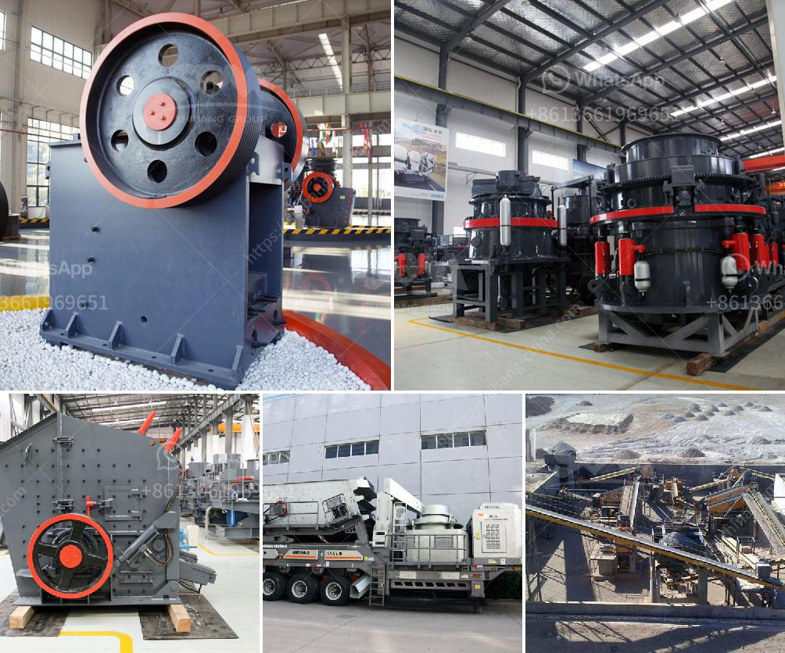

<h3>changchai ballast crusher</h3>
Road construction is a crucial aspect of infrastructure development, and ballast is an essential component in ensuring its stability and durability. Changchai Ballast Crusher is a powerful machine that is specifically designed for crushing stones into small pieces. This robust crusher can efficiently crush different types of materials, including rocks, pebbles, and gravel, to produce high-quality ballast.

One of the significant advantages of Changchai Ballast Crusher is its sustainability. This innovative machine not only efficiently crushes stone, but it also recycles waste materials. By utilizing recycled materials, it helps reduce the need for new construction materials, which in turn conserves natural resources and minimizes environmental impact.

Moreover, the Changchai Ballast Crusher is an excellent cost-effective solution for road construction. Its durable construction and low maintenance requirements make it an ideal choice for projects with limited budgets. The crusher’s compact design allows for easy transportation and installation, making it suitable for both small and large-scale projects.

Another noteworthy feature of the Changchai Ballast Crusher is its versatility. The machine can crush stones of different sizes, ranging from small gravels to larger rocks, depending on the specific construction requirements. Its adjustable settings ensure that the produced ballast meets the desired specifications, making it suitable for various road construction projects.

Safety is of paramount importance in any construction endeavor, and the Changchai Ballast Crusher guarantees the well-being of its users. It is equipped with advanced safety features, such as a secure enclosure and user-friendly controls, ensuring a safe working environment for operators.

In conclusion, the Changchai Ballast Crusher is a sustainable, cost-effective, and versatile solution for road construction. Its ability to crush and recycle different materials makes it an eco-friendly choice, reducing waste and promoting resource conservation. With its compact design and safety features, this crusher is an excellent addition to any construction site. By choosing the Changchai Ballast Crusher, construction companies can contribute to a greener, more sustainable future for generations to come.
<h3>Contact us</h3><ul><li><strong>Whatsapp:&nbsp;<a href="https://wa.me/8613661969651">+8613661969651</a></strong></li><li><a href="https://swt.shibang-china.com/?git&amp;zhl&amp;changchai ballast crusher"><strong>Online Service(chat now)</strong></a></li></ul><h3>Related</h3><ul><li><a href='slag cement manufacturing process youtube.md'>slag cement manufacturing process youtube</a></li><li><a href='crusher plant cost in pakistan.md'>crusher plant cost in pakistan</a></li><li><a href='raymond mill for sale.md'>raymond mill for sale</a></li><li><a href='stone crusher machine for hire in mpumalanga.md'>stone crusher machine for hire in mpumalanga</a></li><li><a href='standar operasional prosedur batubara mininh.md'>standar operasional prosedur batubara mininh</a></li></ul>