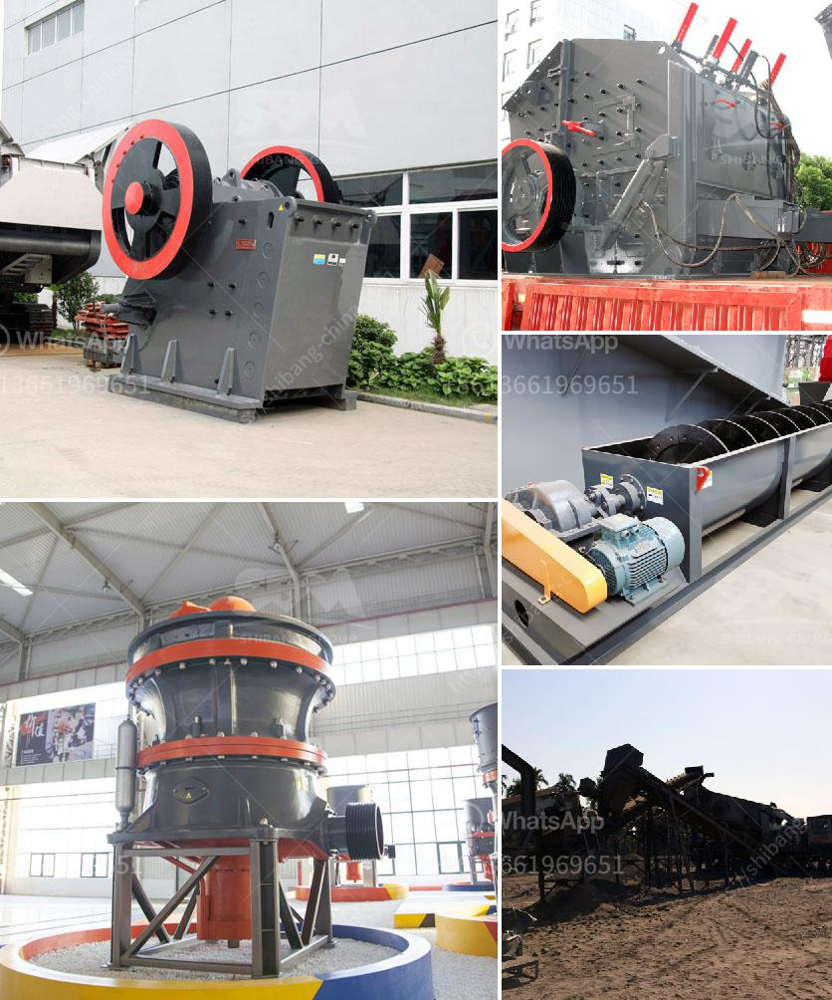

<h3>changsha kaiyuan coal crusher</h3>
Changsha Kaiyuan Instruments Co., Ltd. is one of the leading coal crusher manufacturers in China, providing a wide range of high-quality products. With advanced technology and excellent craftsmanship, their coal crushers have been exported to many countries and regions around the world.

The Changsha Kaiyuan coal crusher is designed specifically for coal samples in coal mines and coal preparation plants. It can crush different types of coal, such as bituminous coal, anthracite, lignite, and coal gangue. It is widely used for the crushing of raw coal, coal block, and other materials. The machine uses a high-speed rotating hammer to impact and shear the coal and has the advantages of simple structure, large crushing ratio, and high production efficiency.

The coal crusher produced by Changsha Kaiyuan Instruments Co., Ltd. is recognized by many coal mines and coal preparation plants for its high efficiency, reliability, and durability. The company has a strong technical team, continuously improving the design and manufacturing process to ensure the quality and performance of their crushers.

In addition to coal crushers, Changsha Kaiyuan Instruments Co., Ltd. also offers a comprehensive range of laboratory equipment for coal analysis, including coal sample preparation equipment, coal quality analysis instruments, and more. These products are widely used in coal mines, power plants, metallurgical and chemical industries, and scientific research institutions.

Changsha Kaiyuan Instruments Co., Ltd. has a commitment to providing customers with high-quality products and excellent service. They adhere to strict quality control standards, ensuring that each coal crusher is manufactured with precision and meets the highest industry standards. With their innovative technology and comprehensive range of products, Changsha Kaiyuan Instruments Co., Ltd. has become a trusted name in the coal mining industry.

In conclusion, the Changsha Kaiyuan coal crusher is a reliable and efficient crushing machine that is suitable for coal samples in coal mines and coal preparation plants. With advanced technology and excellent craftsmanship, this coal crusher is highly acclaimed by the customers. Changsha Kaiyuan Instruments Co., Ltd. remains committed to delivering high-quality products and exceptional service to its customers in the coal mining industry.
<h3>Contact us</h3><ul><li><strong>Whatsapp:&nbsp;<a href="https://wa.me/8613661969651">+8613661969651</a></strong></li><li><a href="https://swt.shibang-china.com/?git&amp;zhl&amp;changsha kaiyuan coal crusher"><strong>Online Service(chat now)</strong></a></li></ul><h3>Related</h3><ul><li><a href='coal vibrating screen manufacturers in south africa.md'>coal vibrating screen manufacturers in south africa</a></li><li><a href='machines used for mining gypsum.md'>machines used for mining gypsum</a></li><li><a href='feldspar ball mills manufacturers.md'>feldspar ball mills manufacturers</a></li><li><a href='single cylinder hydraulic cone crusher.md'>single cylinder hydraulic cone crusher</a></li><li><a href='hard rock crushers.md'>hard rock crushers</a></li></ul>