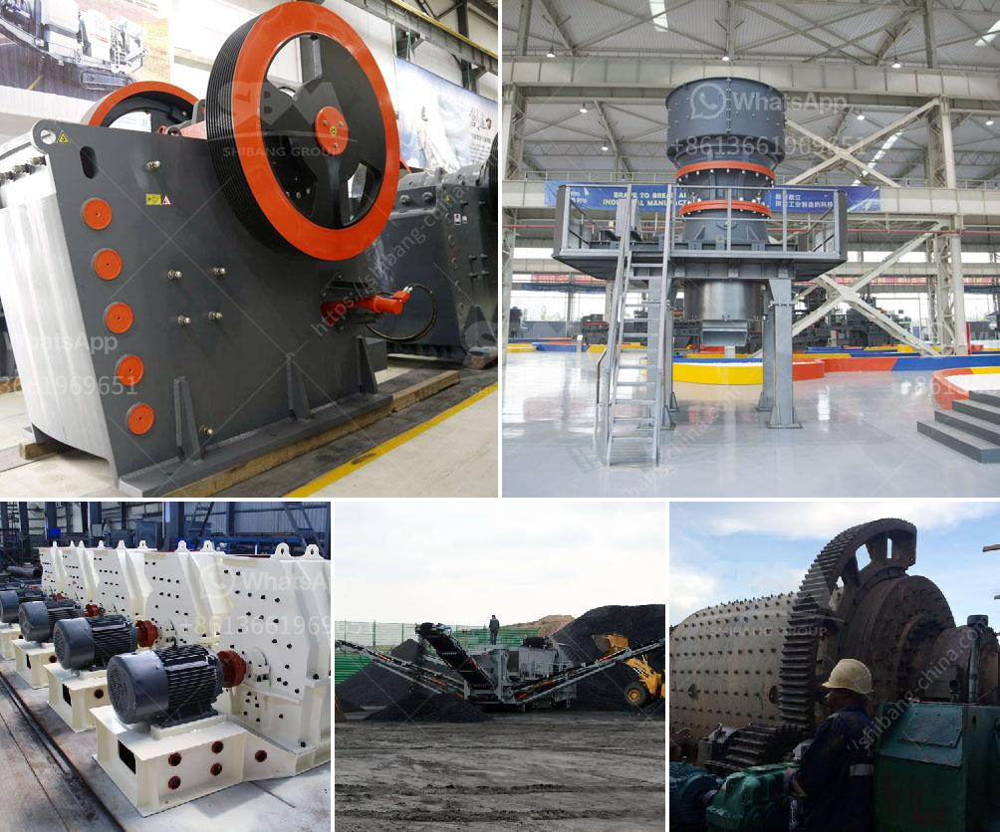

<h3>cheap used quarry machines italy</h3>
Italy is renowned for its rich history, stunning architecture, and mouth-watering cuisine. However, this European nation also boasts a thriving quarrying industry, contributing significantly to its economy. Quarrying machines play a pivotal role in extracting precious resources for construction projects, making them an indispensable asset for companies operating in this sector. If you are looking for cheap used quarry machines in Italy, you're in luck, as this dynamic market offers an extensive range of options that cater to various budgets.

Italian quarry machine manufacturers have established themselves as industry leaders thanks to their commitment to quality, innovation, and durability. Fortunately, this reputation means that when purchasing used quarry machines in Italy, customers can still acquire top-notch equipment. These machines undergo rigorous testing before being put up for sale, ensuring optimal performance and reliability, even after years of operation.

From excavators and loaders to drills and crushers, the range of used quarry machines in Italy is vast. Clients can find machines suitable for small-scale projects, as well as those designed to tackle larger-scale operations. Moreover, the availability of these machines on the market ensures that buyers can find competitive prices, making it a cost-effective investment for businesses.

Before purchasing a used quarry machine, it is essential to consider factors such as its age, maintenance history, and any necessary repairs or refurbishments. Additionally, buyers should examine the machine's specifications to ensure it meets their specific project requirements. Consulting with experts or specialists in the field can provide valuable insights into the machine's condition and potential future maintenance costs.

Furthermore, purchasing a used quarry machine from Italy offers an eco-friendly advantage, as it extends the lifespan of equipment and reduces the need for new manufacturing, thereby minimizing carbon emissions and resource consumption.

In conclusion, Italy offers a wide range of affordable options for those seeking used quarry machines. With its well-established quarrying industry and renowned manufacturers, businesses can find machinery that meets their needs and budgets while also contributing to sustainable practices. Don't miss out on the opportunity to acquire high-quality, cost-effective quarry machines from Italy's thriving market.
<h3>Contact us</h3><ul><li><strong>Whatsapp:&nbsp;<a href="https://wa.me/8613661969651">+8613661969651</a></strong></li><li><a href="https://swt.shibang-china.com/?git&amp;zhl&amp;cheap used quarry machines italy"><strong>Online Service(chat now)</strong></a></li></ul><h3>Related</h3><ul><li><a href='iron ore 100 150tph belt conveyor price.md'>iron ore 100 150tph belt conveyor price</a></li><li><a href='100tpd cement mill manufacturers.md'>100tpd cement mill manufacturers</a></li><li><a href='ball mill 5kg capacity price.md'>ball mill 5kg capacity price</a></li><li><a href='small concrete crushers for low capacity.md'>small concrete crushers for low capacity</a></li><li><a href='vertical shaft impact crusher technical specifications.md'>vertical shaft impact crusher technical specifications</a></li></ul>