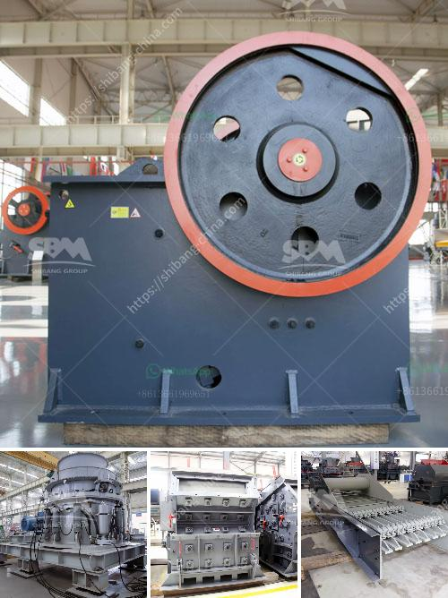

<h3>china ball mill supplier</h3>
China is renowned for its manufacturing capabilities and is considered a leading player in various industries. One such industry where China has made significant progress is the mining sector. Among the essential equipment used in mining operations is the ball mill, which is responsible for grinding and crushing materials into fine powder. To meet the demanding needs of the mining industry, numerous ball mill suppliers have emerged in China.

China ball mill suppliers have a long history of providing high-quality equipment for various industrial applications. They cater to diverse mining needs and offer a wide range of options that suit different production processes. These suppliers are committed to using advanced technology and implementing stringent quality control measures to ensure the efficiency and reliability of their products.

One of the factors that distinguish China ball mill suppliers is their adherence to international standards. They focus on continuously improving the design and performance of their equipment to meet global expectations. These suppliers also emphasize the importance of after-sales service and technical support, ensuring that customers receive assistance whenever needed.

Additionally, China ball mill suppliers cater to both small-scale and large-scale mining operations. They offer equipment with varying capacities, ensuring that customers can find the right mill size for their specific requirements. This flexibility is crucial for mining operations, enabling them to optimize their productivity and efficiency.

China ball mill suppliers are also known for their competitive pricing. They understand the significance of cost-effectiveness for mining companies and strive to provide affordable yet high-quality equipment. Moreover, these suppliers often offer customizable solutions, allowing customers to tailor their purchases according to their budget and operational constraints.

In conclusion, China has positioned itself as a prominent player in the global market of ball mill suppliers. The country's relentless pursuit of technological advancements and commitment to quality has made it a preferred choice for mining companies worldwide. China ball mill suppliers deliver reliable, efficient, and cost-effective equipment, catering to the diverse needs of the mining industry.
<h3>Contact us</h3><ul><li><strong>Whatsapp:&nbsp;<a href="https://wa.me/8613661969651">+8613661969651</a></strong></li><li><a href="https://swt.shibang-china.com/?git&amp;zhl&amp;china ball mill supplier"><strong>Online Service(chat now)</strong></a></li></ul><h3>Related</h3><ul><li><a href='ball mill grinding rotate.md'>ball mill grinding rotate</a></li><li><a href='manufacturer of ball mill companies indonesia.md'>manufacturer of ball mill companies indonesia</a></li><li><a href='south africa crusher sale.md'>south africa crusher sale</a></li><li><a href='crushing plant turkey.md'>crushing plant turkey</a></li><li><a href='hammer mill grinder thailand.md'>hammer mill grinder thailand</a></li></ul>