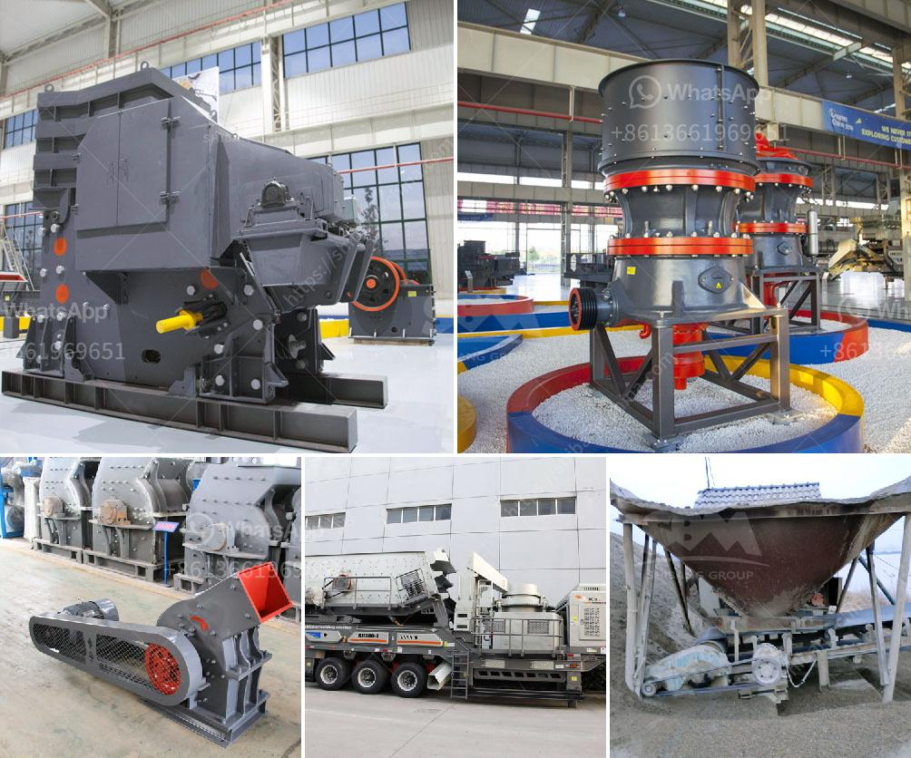

<h3>china manufacturers of sand washing machine</h3>
China has emerged as a global manufacturing hub, known for its excellent quality and cost-effective products in various industries. The sand washing machine is one such product that showcases China's prowess in the manufacturing sector.

Sand washing machines are essential equipment in sand production lines, primarily used to remove impurities such as dust, silt, and other unwanted particles from sand. These machines enhance the quality of the sand, making it suitable for various construction and industrial applications.

China boasts a vast network of manufacturers specializing in the production of sand washing machines. These manufacturers utilize cutting-edge technology and advanced machinery to manufacture high-quality and efficient machines. With years of experience in the industry, they understand the complex requirements of customers and design machines that cater to their specific needs.

China manufacturers of sand washing machines offer a wide range of options to choose from. They provide machines of various capacities, ranging from compact models suitable for small-scale operations to large-scale machines capable of handling tons of sand per hour. Additionally, these manufacturers offer customizable features, allowing customers to tailor the machines to their specific requirements.

One of the significant advantages of China manufacturers is their competitive pricing. China's manufacturing sector benefits from economies of scale, allowing them to offer sand washing machines at lower prices compared to their international counterparts. This affordability makes Chinese machines a preferred choice for buyers worldwide.

Furthermore, China manufacturers ensure the quality of their products by adhering to strict quality control measures. They conduct thorough inspections and rigorous tests at every stage of the manufacturing process to ensure the durability and reliability of their sand washing machines. Many manufacturers also comply with international quality standards and certifications, instilling confidence in their products.

China's manufacturers of sand washing machines also prioritize customer satisfaction. They offer excellent after-sales service, including technical support, spare parts availability, and maintenance assistance. This commitment to customer care further strengthens the reputation of China manufacturers in the global market.

In conclusion, China's manufacturers of sand washing machines have established themselves as leaders in the industry. Their commitment to quality, competitive pricing, and customer satisfaction make them a top choice for buyers worldwide. With China's manufacturing prowess, customers can expect reliable and efficient sand washing machines that meet their specific requirements.
<h3>Contact us</h3><ul><li><strong>Whatsapp:&nbsp;<a href="https://wa.me/8613661969651">+8613661969651</a></strong></li><li><a href="https://swt.shibang-china.com/?git&amp;zhl&amp;china manufacturers of sand washing machine"><strong>Online Service(chat now)</strong></a></li></ul><h3>Related</h3><ul><li><a href='crushing plant cost.md'>crushing plant cost</a></li><li><a href='cost of ball mill 40tonns capacity.md'>cost of ball mill 40tonns capacity</a></li><li><a href='manufactured sand screening machine.md'>manufactured sand screening machine</a></li><li><a href='ball mill operating rpm calculation.md'>ball mill operating rpm calculation</a></li><li><a href='diamond mobile wash plant price.md'>diamond mobile wash plant price</a></li></ul>