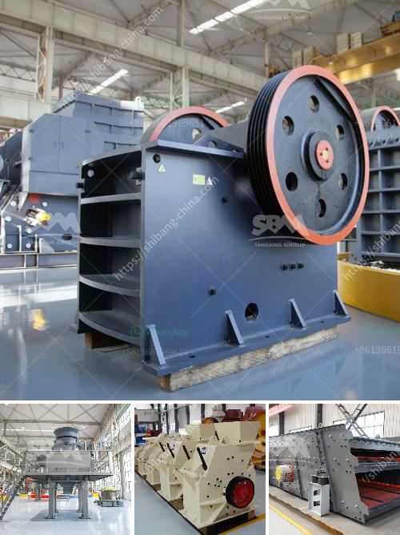

<h3>china mobile stone crusher machine</h3>
Stone crusher machines are necessary equipment in mining machinery and construction machinery. In China, due to the wide range of application fields and the excellent performance, the demand for stone crusher machines is growing. Since China has rich rock resources, sand and gravel aggregate production has gradually become one of the main industries in the country.

China mobile stone crusher machine is a high-tech machine, which can crush various materials such as granite, marble, basalt, iron ore, river pebbles, construction waste, etc. It is widely used in mining, construction, road construction, and other industries.

1. Convenient mobility: The mobile crushing station is a fixed crusher equipped with a mobile drive chassis. Compared with fixed crushers, it can be easily moved in various environments with a small footprint and high flexibility.

2. Strong adaptability: China mobile stone crusher machine adopts a new way of crushing and screening, with high efficiency and low cost. It not only expands the scope of application, but also reduces the investment cost.

3. Energy-saving and environmental protection: The mobile crushing station has low energy consumption and environmentally friendly design. It adopts advanced intelligent control system to achieve remote control, thus saving manpower and reducing environmental pollution caused by dust and noise.

4. High crushing efficiency: The China mobile stone crusher machine provides a new field of business opportunities for contractors, quarry operators, recycling and mining applications. It offers high efficient and low-cost project plan without the limit of environment for the client.

5. Good performance and reliable operation: China mobile stone crusher machine uses advanced intelligent control system to ensure the smooth operation of the equipment, which greatly reduces the failure rate and improves the production efficiency.

China mobile stone crusher machine is widely used in road and bridge construction, urban construction, metallurgy, energy, and other departments, commonly used crushing machinery in various materials processing. Users can use a variety of configuration forms according to the types of raw materials, sizes and requirements of finished materials.

In conclusion, China mobile stone crusher machine has a wide range of application, which can process various stones with a particle size of 500mm. It can be used in the fields of metallurgy, construction, chemical industry, mining, cement, etc. The advantages of mobile stone crusher machines are high crushing efficiency, lower investment cost, and convenient movement. So what are you waiting for? Choose a reliable China mobile stone crusher machine supplier and start your business now.
<h3>Contact us</h3><ul><li><strong>Whatsapp:&nbsp;<a href="https://wa.me/8613661969651">+8613661969651</a></strong></li><li><a href="https://swt.shibang-china.com/?git&amp;zhl&amp;china mobile stone crusher machine"><strong>Online Service(chat now)</strong></a></li></ul><h3>Related</h3><ul><li><a href='vertical grinding machine manufacturers.md'>vertical grinding machine manufacturers</a></li><li><a href='portalble stone crusher.md'>portalble stone crusher</a></li><li><a href='coal crusher for sale in south africa.md'>coal crusher for sale in south africa</a></li><li><a href='impact pulverizer model sje25.md'>impact pulverizer model sje25</a></li><li><a href='stone crusher plant capacity 500 600 tph.md'>stone crusher plant capacity 500 600 tph</a></li></ul>