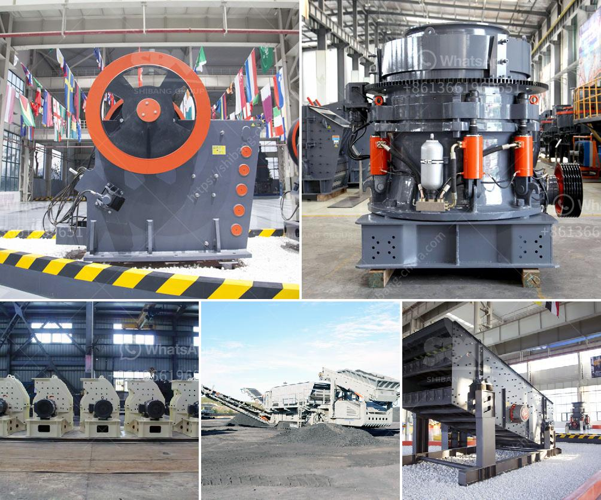

<h3>china quartz sand dryer manufacturer</h3>
Quartz sand dryer is a machine that is used to dry quartz sand in various industries such as construction, chemical, agriculture, and more. With the continuous improvement of technology, quartz sand dryer has become more advanced and efficient. As a result, there are many manufacturers in China that produce and supply high-quality and reliable quartz sand dryers.

One such manufacturer is located in China and has gained a solid reputation in the industry. This manufacturer is committed to providing customers with excellent quality quartz sand dryers that meet their specific requirements. They have a team of skilled engineers and technicians who ensure that each dryer is manufactured to the highest standards.

In terms of quality, the China quartz sand dryer manufacturer uses top-grade materials and state-of-the-art machinery in the production process. This enables them to create dryers that are highly durable, efficient, and long-lasting. The advanced technology used in their dryers ensures that the drying process is performed quickly and with minimal energy consumption.

Furthermore, this manufacturer understands the importance of offering competitive prices to their customers. They strive to keep their prices affordable without compromising on the quality of their products. This not only attracts potential customers but also helps in building long-term relationships.

Another advantage of choosing this China quartz sand dryer manufacturer is their excellent customer service. They have a responsive and friendly team that is always ready to assist customers with any queries or concerns. Whether it is providing guidance on choosing the right dryer or offering after-sales support, they go the extra mile to ensure customer satisfaction.

In conclusion, when it comes to purchasing quartz sand dryers, it is advisable to consider a reliable and reputable manufacturer in China. With their excellent quality, competitive prices, and top-notch customer service, this particular manufacturer stands out from the rest. By choosing their quartz sand dryers, customers can be assured of getting a high-performing and durable product that meets their specific needs.
<h3>Contact us</h3><ul><li><strong>Whatsapp:&nbsp;<a href="https://wa.me/8613661969651">+8613661969651</a></strong></li><li><a href="https://swt.shibang-china.com/?git&amp;zhl&amp;china quartz sand dryer manufacturer"><strong>Online Service(chat now)</strong></a></li></ul><h3>Related</h3><ul><li><a href='rock processing plant.md'>rock processing plant</a></li><li><a href='cone crusher supply.md'>cone crusher supply</a></li><li><a href='cone crusher manufacturers in france.md'>cone crusher manufacturers in france</a></li><li><a href='stone crusher for sales in south philippines.md'>stone crusher for sales in south philippines</a></li><li><a href='vertical grinding machine manufacturers.md'>vertical grinding machine manufacturers</a></li></ul>