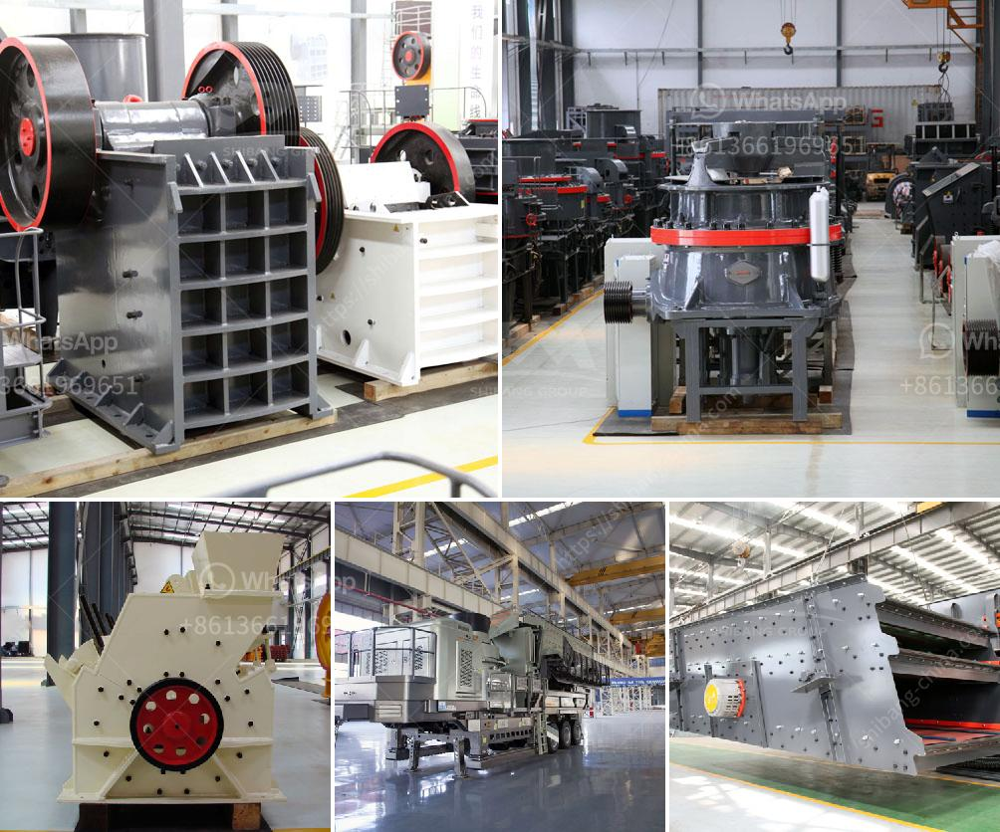

<h3>china roller mill kenya</h3>
In recent years, China has been taking significant strides in its technological advancements, and one industry that has greatly benefited from this progress is the milling sector. One particular innovation that has revolutionized milling operations in Kenya is the China roller mill. This state-of-the-art piece of machinery has vastly improved the efficiency and productivity of milling processes, offering numerous benefits to millers and farmers alike.

The China roller mill is a machine designed to grind grains into flour through the use of multiple rotating rollers that crush and grind the grains. Unlike traditional milling methods, which rely on a single vertical grinding stone, the roller mill utilizes a series of horizontally arranged rotating rollers to produce flour. This enables the machine to process a larger quantity of grains at a much faster rate, leading to increased efficiency and reduced operating costs.

One of the most significant advantages of the China roller mill is its ability to produce a finer grade of flour compared to traditional milling methods. The precise grinding mechanism of the machine ensures that the grains are uniformly ground, resulting in a superior quality flour. This finer flour is highly desirable in various food production processes, such as baking, as it produces lighter, fluffier, and more consistent end products.

Furthermore, the China roller mill is incredibly versatile, capable of processing a wide range of grains, including wheat, maize, sorghum, and rice. This flexibility has made it an invaluable tool for millers in Kenya, as it allows them to cater to the diverse demands of the local market. Whether it's producing flour for bread, chapati, or porridge, the roller mill can efficiently process different grains to meet consumer preferences.

Another standout feature of the China roller mill is its durability and low maintenance requirements. The machine is built to withstand the rigors of heavy-duty milling operations, enabling millers to run their operations for extended periods without major breakdowns or maintenance interventions. This durability, coupled with minimal maintenance needs, significantly reduces downtime and ensures uninterrupted production.

The China roller mill has also contributed to the empowerment of local farmers in Kenya. By investing in this advanced milling technology, farmers can process their own grains into flour, eliminating the need for costly outsourcing services. This vertical integration not only provides farmers with an additional income stream but also allows them to add value to their produce and gain a competitive edge in the market.

Overall, the introduction of the China roller mill in Kenya has transformed the milling sector, boosting efficiency, productivity, and product quality. From its ability to produce finer flour to its versatility and durability, this innovative machine has revolutionized milling operations, benefiting both millers and farmers. As China continues to pioneer technological advancements, it is undoubtedly playing a pivotal role in shaping the future of the global milling industry.
<h3>Contact us</h3><ul><li><strong>Whatsapp:&nbsp;<a href="https://wa.me/8613661969651">+8613661969651</a></strong></li><li><a href="https://swt.shibang-china.com/?git&amp;zhl&amp;china roller mill kenya"><strong>Online Service(chat now)</strong></a></li></ul><h3>Related</h3><ul><li><a href='activated bentonite production line.md'>activated bentonite production line</a></li><li><a href='stone jaw crusher.md'>stone jaw crusher</a></li><li><a href='mobile plant sand screen for sale.md'>mobile plant sand screen for sale</a></li><li><a href='roll crusher kenya.md'>roll crusher kenya</a></li><li><a href='crusher equipment dubai.md'>crusher equipment dubai</a></li></ul>