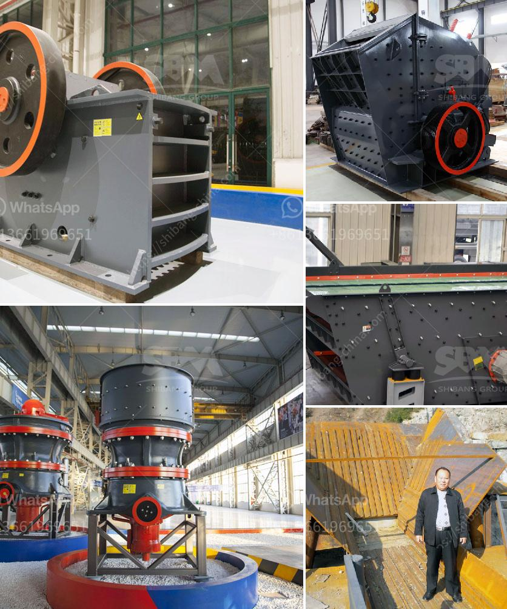

<h3>china silica sand vibrating screen</h3>
Silica sand is an important industrial raw material used in various industries, like glass, foundry, ceramics, construction, chemicals, and electronics. Due to its high melting point and resistance to heat and chemicals, it is considered highly valuable. However, before it can be used in various applications, it needs to undergo a screening process to remove impurities and ensure quality. This is where the China silica sand vibrating screen comes into play.

The China silica sand vibrating screen is a high-efficiency vibrating screen specifically designed for screening silica sand. With a larger screening area and a high-frequency series of vibrations, it efficiently screens thousands of particles within seconds. It helps separate the oversize particles and removes impurities, ensuring a high-quality final product.

One of the key features of the China silica sand vibrating screen is its rugged construction. It is built to withstand the tough conditions of the screening process, including high temperatures, corrosive materials, and abrasive particles. The screen is made of durable materials that can withstand constant exposure to silica sand without any damage.

In addition, the China silica sand vibrating screen is easy to operate and maintain. It is equipped with user-friendly controls and a simple interface, making it easy for operators to adjust the settings and monitor the screening process. Furthermore, it requires minimal maintenance and can be easily cleaned, ensuring efficient operation and a longer lifespan.

The China silica sand vibrating screen is also highly customizable, with various sizes and configurations available to suit different screening requirements. It can be used as a single unit or in tandem with other equipment, depending on the specific application. This flexibility allows for efficient integration into existing plant layouts and processes.

Furthermore, the China silica sand vibrating screen has a wide range of applications beyond silica sand screening. It can also be used for screening other materials like stone, gravel, ores, and minerals. Its versatility and high efficiency make it a valuable tool in various industries.

In conclusion, the China silica sand vibrating screen is an essential tool for the screening of silica sand. With its high efficiency, rugged construction, easy operation and maintenance, and wide range of applications, it ensures a high-quality final product. Whether used in the glass, foundry, ceramics, construction, chemicals, or electronics industry, this vibrating screen is an invaluable asset for any production plant.
<h3>Contact us</h3><ul><li><strong>Whatsapp:&nbsp;<a href="https://wa.me/8613661969651">+8613661969651</a></strong></li><li><a href="https://swt.shibang-china.com/?git&amp;zhl&amp;china silica sand vibrating screen"><strong>Online Service(chat now)</strong></a></li></ul><h3>Related</h3><ul><li><a href='barite machinery production plant.md'>barite machinery production plant</a></li><li><a href='quartz stone powder machine manufacturing in india.md'>quartz stone powder machine manufacturing in india</a></li><li><a href='sand washing plant in turkey.md'>sand washing plant in turkey</a></li><li><a href='sand washers machine.md'>sand washers machine</a></li><li><a href='stone crushers for sale usa.md'>stone crushers for sale usa</a></li></ul>