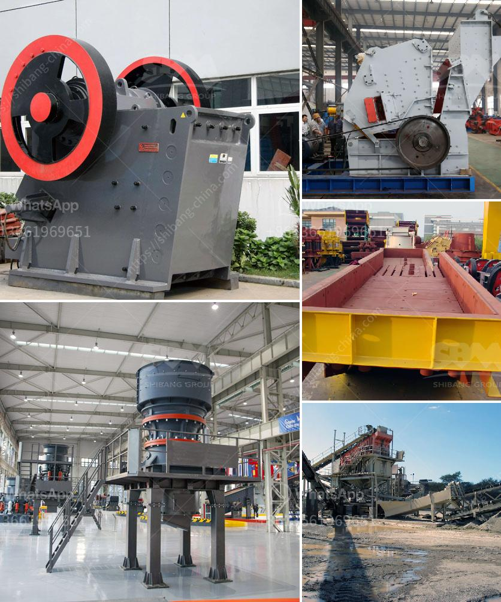

<h3>chinese ore processing plants</h3>
China is at the forefront of the global mining industry, and its ore processing plants play a critical role in meeting the growing demand for various metals and minerals worldwide. With a combination of advanced technologies, abundant resources, and a highly skilled workforce, these plants have become the backbone of global supply chains.

Ore processing plants are facilities where raw ores extracted from mines are refined and processed to extract valuable minerals and metals. China's ore processing plants have gained immense recognition for their efficiency and scale of operations. They have become the primary source for critical minerals like rare earth elements, steelmaking materials like iron ore, and precious metals like gold and silver.

One of the key factors driving the success of Chinese ore processing plants is the country's rich mineral resources. China's vast land area is home to a wide range of minerals, including more than 170 different types. This abundance grants Chinese processors access to a diverse range of ores, providing them a competitive edge in global markets.

Additionally, Chinese ore processing plants have adopted advanced technologies to enhance their efficiency and productivity. These plants are equipped with state-of-the-art machinery and equipment, allowing for highly automated and streamlined operations. This technological prowess has not only improved the quality and quantity of processed materials but also reduced operating costs and minimized environmental impacts.

Moreover, the Chinese government has prioritized the development of the mining and ore processing sector, investing significantly in research and development. This support has resulted in the constant innovation of technologies and processes, further enhancing the capabilities of Chinese ore processing plants. The emphasis on sustainable and eco-friendly practices has also led to the implementation of strict environmental regulations in the sector.

Chinese ore processing plants have undoubtedly contributed to the global supply of various metals and minerals. For instance, China dominates the production of rare earth elements, which are essential for manufacturing high-tech products such as smartphones, electric vehicles, and wind turbines. The country accounts for nearly 80% of global rare earth production, primarily sourced from its well-established ore processing plants.

The significance of Chinese ore processing plants is not limited to rare earths alone. China is also the world's leading producer and consumer of steel, with its ore processing plants playing a pivotal role in supplying steelmaking materials. The plants are equipped to process massive quantities of iron ore, providing a reliable source for the global steel industry.

Furthermore, Chinese ore processing plants have enabled an efficient supply chain for precious metals. China ranks as the world's largest gold producer, with its ore processing plants enabling the extraction and refining of gold and silver. This steady supply plays a crucial role in meeting global demands for jewelry, investment, and industrial applications.

In conclusion, Chinese ore processing plants have emerged as global powerhouses, supplying crucial minerals and metals to various industries worldwide. These plants leverage the country's abundant mineral resources, advanced technologies, and supportive government policies to ensure efficient and sustainable operations. As global demand continues to rise, Chinese ore processing plants will remain instrumental in meeting the evolving needs of industries reliant on metals and minerals.
<h3>Contact us</h3><ul><li><strong>Whatsapp:&nbsp;<a href="https://wa.me/8613661969651">+8613661969651</a></strong></li><li><a href="https://swt.shibang-china.com/?git&amp;zhl&amp;chinese ore processing plants"><strong>Online Service(chat now)</strong></a></li></ul><h3>Related</h3><ul><li><a href='limestone plant and machinery.md'>limestone plant and machinery</a></li><li><a href='stone crusher equipment manufacturer.md'>stone crusher equipment manufacturer</a></li><li><a href='granite crushers in germany.md'>granite crushers in germany</a></li><li><a href='secondary jaw crusher.md'>secondary jaw crusher</a></li><li><a href='rock quarry plant.md'>rock quarry plant</a></li></ul>