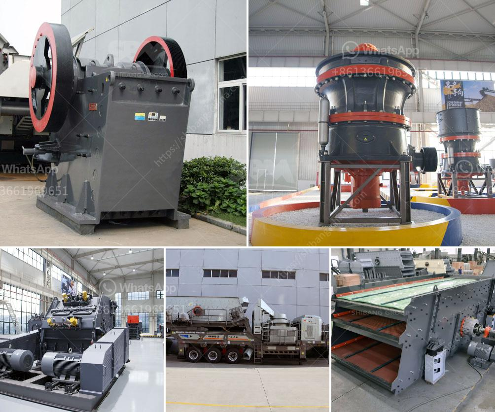

<h3>chrome mining business plan crusher</h3>
Chrome mining is a lucrative business venture that entails excavating and extracting this valuable mineral from the earth's crust. Chrome is used in various industries, from stainless steel manufacturing to chemical production. As a result, the demand for chrome is always high, making chrome mining a potentially profitable enterprise.

To establish a successful chrome mining business, a well-crafted business plan is essential. This plan serves as a blueprint for the company's operations, outlining the steps and strategies needed to achieve profitability and sustainability. Here is an outline of a chrome mining business plan that contains key aspects to consider:

1. Executive Summary: Provide an overview of the business, including the mission statement, objective, and a brief description of the company's activities in the chrome mining sector. Highlight the market demand for chrome and the potential for growth in the industry.

2. Market Analysis: Conduct thorough research on the chrome industry, including the current market trends, competition, and customers' preferences. Identify the target market segments, such as stainless steel manufacturers, chemical plants, and other industries that heavily rely on chrome.

3. Business Structure: Define the legal structure of the business, whether it is a sole proprietorship, partnership, or corporation. Outline the roles and responsibilities of key personnel, including management and operational teams.

4. Products and Services: Describe the range of chrome mining services the company will provide. This could include chrome excavation, extraction, transportation, and selling of chrome ore. Highlight the quality and grade of chrome that the company will offer to potential buyers.

5. Marketing and Sales Strategy: Outline how the business will market its chrome products and attract customers. Develop a sales strategy that includes building relationships with potential buyers, attending industry trade shows and conferences, utilizing online marketing platforms, and establishing long-term contracts with clients.

6. Operations, Facilities, and Equipment: Detail the required infrastructure and equipment needed for chrome mining operations. This includes excavation machinery, crushers, wash plants, dryers, and transportation vehicles. Also, provide information about the mining site, such as the location, size, and accessibility.

7. Financial Projections: Develop comprehensive financial forecasts, including income statements, cash flow projections, and balance sheets. Estimate the initial investment required for equipment, permits, licenses, and personnel. Determine the expected revenue and profit margins based on projected sales and market demand.

8. Risk Management and Sustainability: Identify potential risks and challenges in the chrome mining business, such as fluctuations in chrome prices, environmental regulations, and competition. Develop strategies to mitigate these risks, as well as plans for sustainable mining practices that prioritize environmental preservation.

9. Legal and Regulatory Compliance: Identify and comply with all legal requirements and regulations in the mining industry. This includes obtaining the necessary permits and licenses, adhering to environmental and safety protocols, and ensuring ethical mining practices.

10. Future Growth and Expansion: Outline the long-term growth and expansion plans for the business. This may involve exploring new mining sites, expanding the range of products and services, or diversifying into related industries.

In conclusion, a well-crafted business plan is essential for a successful chrome mining venture. It provides a roadmap for the company's operations, helps attract potential investors and lenders, and guides the business towards profitability and sustainability. With careful planning and execution, a chrome mining business can capitalize on the high demand for chrome and achieve long-term success.
<h3>Contact us</h3><ul><li><strong>Whatsapp:&nbsp;<a href="https://wa.me/8613661969651">+8613661969651</a></strong></li><li><a href="https://swt.shibang-china.com/?git&amp;zhl&amp;chrome mining business plan crusher"><strong>Online Service(chat now)</strong></a></li></ul><h3>Related</h3><ul><li><a href='limestone powder production process.md'>limestone powder production process</a></li><li><a href='stone crusher plant manufacturers.md'>stone crusher plant manufacturers</a></li><li><a href='simple formula for belt conveyor.md'>simple formula for belt conveyor</a></li><li><a href='mobile crushers quarry plant south africa.md'>mobile crushers quarry plant south africa</a></li><li><a href='tonne an hour ball mill.md'>tonne an hour ball mill</a></li></ul>