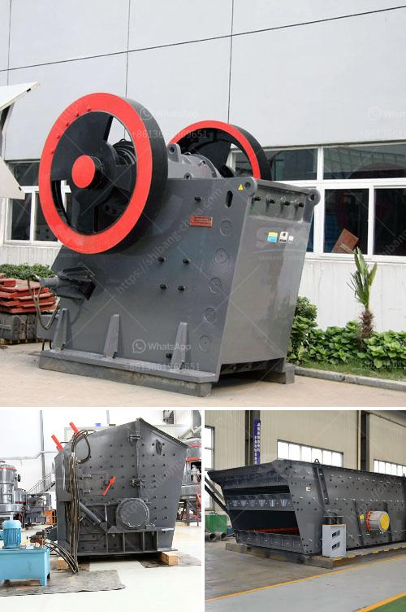

<h3>chrome mining business plan</h3>
Chrome mining is a profitable business venture that has gained prominence in recent years. With the rise in demand for chrome, especially in the manufacturing industry, starting a chrome mining business can be a smart move for entrepreneurs looking to tap into this lucrative market.

Before starting the chrome mining business, it is essential to develop a comprehensive business plan. A well-designed business plan will serve as a roadmap to guide the entrepreneur through each stage of the chrome mining process.

Firstly, the business plan should outline the objectives and goals of the chrome mining venture. This includes defining the scope of the business, target market, and potential revenue streams. The plan should also emphasize the company's unique selling proposition, such as low-cost mining techniques or superior quality chrome deposits.

Next, the business plan should include a thorough analysis of the industry and market conditions. This involves researching the current and projected demand for chrome, understanding the competition, and identifying potential customers. Key market trends, pricing dynamics, and regulatory considerations should also be highlighted in this section.

A critical part of the business plan is the financial analysis. This includes estimating the initial investment required to start the chrome mining operation. The entrepreneur must account for expenses such as land acquisition, equipment purchase, permits and licenses, and operational costs. It is important to conduct a detailed cost-benefit analysis to ensure the viability and profitability of the business.

Moreover, the business plan should outline the production process and operational strategy. This involves describing the mining techniques, equipment required, and the timeline for extraction and processing. The plan should also address environmental concerns and compliance with local regulations, ensuring responsible and sustainable mining practices.

Another crucial aspect of the business plan is the marketing and sales strategy. This includes identifying potential customers, such as steel manufacturers or automotive companies, and developing a sales pitch highlighting the advantages of the company's chrome deposits. Marketing channels, such as online advertising or participating in industry trade shows, should be outlined in this section.

Furthermore, the business plan should address the organizational structure and management team. Individuals with relevant experience in the mining industry or business management should be identified. The plan should also outline the human resource requirements, including hiring and training strategies.

Lastly, the business plan should include a comprehensive risk assessment and mitigation strategy. Potential risks, such as fluctuating chrome prices or environmental concerns, should be identified, and contingency plans should be developed to mitigate these risks.

In conclusion, starting a chrome mining business can be a lucrative venture with the increasing demand for chrome. However, it is crucial to develop a well-designed business plan to ensure the success and sustainability of the operation. The plan should include a thorough analysis of the market, a solid financial analysis, a comprehensive operational strategy, and a robust marketing and sales plan. With the right plan in place, entrepreneurs can tap into the chrome mining business and reap the rewards of this booming industry.
<h3>Contact us</h3><ul><li><strong>Whatsapp:&nbsp;<a href="https://wa.me/8613661969651">+8613661969651</a></strong></li><li><a href="https://swt.shibang-china.com/?git&amp;zhl&amp;chrome mining business plan"><strong>Online Service(chat now)</strong></a></li></ul><h3>Related</h3><ul><li><a href='almada crusher machine in mumbai.md'>almada crusher machine in mumbai</a></li><li><a href='carbon grinding machine.md'>carbon grinding machine</a></li><li><a href='sale for stone crusher.md'>sale for stone crusher</a></li><li><a href='ball mills for measured mining.md'>ball mills for measured mining</a></li><li><a href='price crusher 30 ton.md'>price crusher 30 ton</a></li></ul>