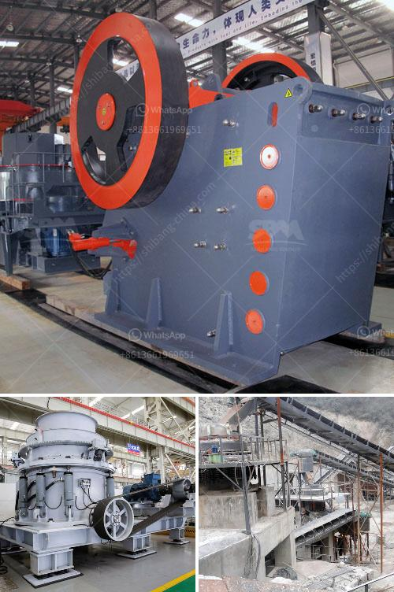

<h3>chromite crushing plant in karachi pakistan sale</h3>
Chromite is a mineral composed primarily of iron, magnesium, and chromium oxide. It is categorized as an essential ore mineral, and it is the only commercial source of chromium metal. Chromite crushing plant in Karachi Pakistan sale is an integral part of the mining industry. This machinery has been installed and is being utilized for efficient chromite extraction. Chromite ore is transported to the crushing plant by trucks and dumped onto a vibrating grizzly feeder to separate large-sized rocks from smaller-sized ones. The smaller-sized chromite rocks pass through the grizzly feeder and into the primary jaw crusher, where they are crushed further into smaller pieces.

Once the chromite ore is reduced in size, it is then transported to the secondary cone crusher for further crushing. The cone crusher breaks the chromite into smaller pieces, making it easier for further processing. The crushed material from the secondary cone crusher is conveyed to the vibrating screen for size classification. Various screen sizes are used to separate the chromite into different fractions based on their sizes.

The chromite fractions are then conveyed to the storage bin or stockpile for further transportation. The stockpiled material is then loaded onto trucks or trains to be transported to various locations where it will undergo further processing. The chromite ore is typically processed further to produce ferrochrome, which is used in the production of stainless steel. Additional processing steps may be necessary to remove impurities and increase the chromium content of the chromite.

The chromite crushing plant in Karachi Pakistan sale plays a crucial role in the production of ferrochrome. The high-quality chromite ore is selectively processed using specialized machinery and advanced technology to ensure the desired chromite concentration and purity. This ensures that the end product, ferrochrome, meets the strict quality requirements of the stainless steel industry.

The chromite crushing plant in Karachi Pakistan sale is operated by skilled workers who are trained in the safe and efficient operation of the machinery. The plant is also equipped with advanced safety features to ensure the protection of the workers and the environment. Regular maintenance and inspections are carried out to ensure the smooth operation of the machinery and prevent any breakdowns or accidents. Any issues or concerns are immediately addressed to minimize downtime and maintain productivity.

Overall, the chromite crushing plant in Karachi Pakistan sale is an essential part of the mining industry. It plays a crucial role in ensuring the efficient extraction of chromite ore and the production of high-quality ferrochrome. The plant is operated by skilled workers and is equipped with advanced machinery and safety features. The machinery is regularly maintained and inspected to ensure its proper functioning. With the growing demand for stainless steel, the chromite crushing plant will continue to play a significant role in meeting the industry's requirements and contributing to economic growth.
<h3>Contact us</h3><ul><li><strong>Whatsapp:&nbsp;<a href="https://wa.me/8613661969651">+8613661969651</a></strong></li><li><a href="https://swt.shibang-china.com/?git&amp;zhl&amp;chromite crushing plant in karachi pakistan sale"><strong>Online Service(chat now)</strong></a></li></ul><h3>Related</h3><ul><li><a href='bentonite clay processing production line supplier.md'>bentonite clay processing production line supplier</a></li><li><a href='chrome mining business plan crusher.md'>chrome mining business plan crusher</a></li><li><a href='quartz ball milling machinery.md'>quartz ball milling machinery</a></li><li><a href='mining conveyors for sale in zimbabwe.md'>mining conveyors for sale in zimbabwe</a></li><li><a href='prices of hammer mill in zimbabwe.md'>prices of hammer mill in zimbabwe</a></li></ul>