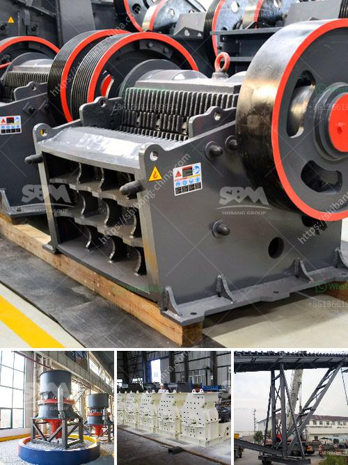

<h3>clay grinder machine india</h3>
India is a country rich in natural resources, including clay. With a heritage of pottery and clay craftsmanship that dates back centuries, it is no surprise that there is a thriving market for clay grinder machines in India. These machines are used to grind various forms of clay into a fine powder, which is then used in numerous industries such as ceramics, pottery, and construction.

The clay grinder machines in India are designed to grind different types of clay, such as fire clay, terracotta clay, bentonite clay, and kaolin clay. The machines are made of robust materials to withstand the harsh Indian conditions and ensure long-lasting performance.

One of the main advantages of using a clay grinder machine is that it allows for a consistent and uniform grinding of the clay. This is particularly important in industries such as ceramics, where the quality of the clay powder directly affects the quality of the end product. By using a clay grinder machine, manufacturers can ensure that the clay powder is finely ground and free from impurities.

In addition to producing high-quality clay powder, these machines also offer efficient operation and high productivity. They are equipped with powerful motors and cutting-edge grinding technology that enables them to grind large quantities of clay in a short span of time. This is particularly beneficial for large-scale production units, where time is of the essence.

Furthermore, clay grinder machines in India are designed to be user-friendly and easy to operate. They come with intuitive controls and clear instructions, making it easy for operators to grind clay efficiently without any hassle. This makes them suitable for both skilled workers and those new to the industry.

The clay grinder machines in India are also equipped with safety features to ensure the well-being of the operators. They are designed to prevent any accidental injuries during the grinding process, such as the machine starting up unexpectedly or flying debris. This is crucial in industries where workers come into direct contact with the machines on a daily basis.

Additionally, the clay grinder machines available in India are known for their durability and low maintenance requirements. They are built to withstand the demanding conditions of the industry and are designed to handle heavy-duty grinding. This ensures that the machines can be used for extended periods of time without any significant breakdowns or maintenance issues.

Overall, the clay grinder machines in India play a crucial role in various industries, enabling manufacturers to produce high-quality clay powder for their products. These machines are reliable, efficient, and easy to use, making them a valuable asset for businesses involved in pottery, ceramics, and construction. With the growing demand for clay products, the market for clay grinder machines in India is expected to further expand in the coming years, offering more options and advanced features to meet the diverse needs of the industry.
<h3>Contact us</h3><ul><li><strong>Whatsapp:&nbsp;<a href="https://wa.me/8613661969651">+8613661969651</a></strong></li><li><a href="https://swt.shibang-china.com/?git&amp;zhl&amp;clay grinder machine india"><strong>Online Service(chat now)</strong></a></li></ul><h3>Related</h3><ul><li><a href='fintec mobile screens for sale australia.md'>fintec mobile screens for sale australia</a></li><li><a href='four roller mill.md'>four roller mill</a></li><li><a href='slag crusher for sale.md'>slag crusher for sale</a></li><li><a href='south africa limestone crushing and blending plant.md'>south africa limestone crushing and blending plant</a></li><li><a href='crusher price rock crusher price 8mm.md'>crusher price rock crusher price 8mm</a></li></ul>