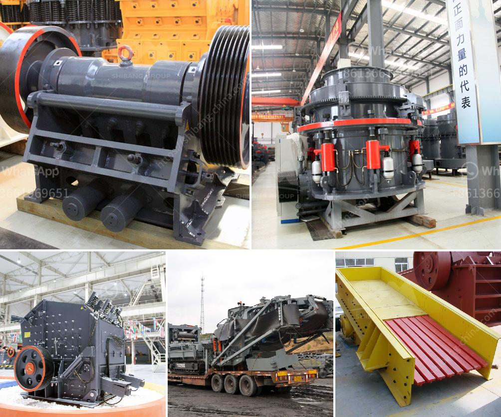

<h3>clay processing technology</h3>
Clay is one of the most versatile and abundant materials found on planet Earth. Used for centuries in various industries, clay has now become even more important due to advancements in clay processing technology. From mining to end product development, the entire process has undergone significant transformations that have revolutionized its applications and usage. In this article, we will explore the journey of clay and its innovative processing technology.

The extraction of clay starts with mining. Clay deposits are found in various regions worldwide, and mining involves the removal of overburden to expose the clay bed. Once the clay bed is exposed, it is excavated using earth-moving equipment and transported to the processing plant.

Once the clay reaches the processing plant, it undergoes a series of steps to remove impurities and enhance its properties. One of the initial steps is called beneficiation, which involves washing the clay to remove any sand, stones, or organic matter. This step ensures that the end product is pure and of high quality.

Next, the clay is subjected to drying. Traditionally, sun drying was employed, but modern technology allows for controlled and efficient drying methods. These methods use techniques such as tunnel dryers, fluidized bed dryers, or spray dryers, which not only accelerate the drying process but also minimize energy consumption.

After drying, the clay is often ground to achieve the desired particle size. Grinding is typically performed using ball mills or other specialized equipment. This step ensures a consistent particle size distribution, enabling better control over the properties of the end product.

To meet specific requirements, clay is often subjected to chemical and thermal treatments during processing. For example, activation treatments involve the addition of certain chemicals to enhance the clay's adsorption properties, making it useful in industries such as water treatment or as a catalyst support.

Thermal treatments, such as calcination, involve subjecting clay to high temperatures to alter its chemical composition and improve its properties. Calcination can result in improved mechanical strength, increased pore volume, and enhanced thermal stability. These advancements have opened up new applications for clay in the manufacturing of ceramics, refractories, and catalyst supports.

The processed clay is now ready for various end products and applications. Clay is used extensively in the construction industry for manufacturing bricks, tiles, ceramics, and cement. Its plasticity, compressibility, and ability to withstand high temperatures make it a highly sought-after material.

Additionally, clay finds its place in the pharmaceutical, cosmetics, and paper industries. Clay minerals are used as fillers, bulking agents, and thickeners due to their natural abundance, low cost, and compatibility with other ingredients.

Moreover, clay is being explored for its potential applications in advanced technologies such as nanocomposites and 3D printing. The unique properties of clay, combined with emerging technologies, have paved the way for innovative solutions in fields ranging from medicine to energy storage.

In conclusion, clay processing technology has come a long way, transforming it from a simple mineral to a versatile and valuable material. Advancements in mining techniques, processing methods, and treatment technologies have broadened the applications of clay across various industries. With ongoing research and development, the future of clay processing technology holds even more exciting possibilities.
<h3>Contact us</h3><ul><li><strong>Whatsapp:&nbsp;<a href="https://wa.me/8613661969651">+8613661969651</a></strong></li><li><a href="https://swt.shibang-china.com/?git&amp;zhl&amp;clay processing technology"><strong>Online Service(chat now)</strong></a></li></ul><h3>Related</h3><ul><li><a href='crushed stone products mwanza tanzania.md'>crushed stone products mwanza tanzania</a></li><li><a href='coal powder mill.md'>coal powder mill</a></li><li><a href='handmade rock crusher.md'>handmade rock crusher</a></li><li><a href='mode of oeration of a gyratory crusher.md'>mode of oeration of a gyratory crusher</a></li><li><a href='hp ball mill motors.md'>hp ball mill motors</a></li></ul>