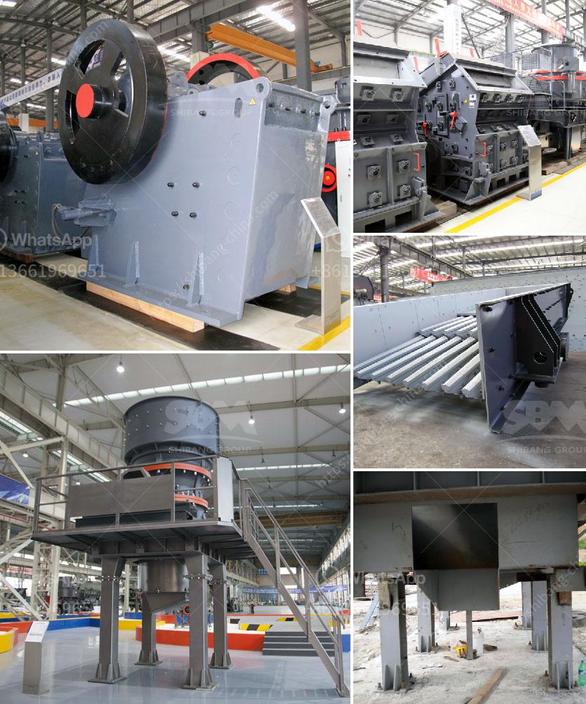

<h3>clay vibrating screen</h3>
The clay vibrating screen is a high-efficiency screening equipment used to classify and separate fine clay and impurities from the material mixture. It is widely used in various industries, such as mining, construction, metallurgy, chemical, and many more. 

One of the key features of the clay vibrating screen is its ability to achieve high precision screening. The screen mesh is made of high-quality stainless steel, which ensures that the screening process is efficient and reliable. The vibrating motor, located at the bottom of the screen, generates strong vibrations that enable the clay particles to pass through the screen mesh easily. 

The clay vibrating screen is also equipped with a unique anti-blinding device, which prevents the screen mesh from getting clogged with clay particles. This device increases the screening efficiency and reduces the downtime required for cleaning and maintenance. 

Another advantage of the clay vibrating screen is its compact design. The screen is mounted on a durable frame, which can be easily transported and installed in any working environment. The small footprint of the equipment makes it suitable for both indoor and outdoor applications.

Moreover, the clay vibrating screen is highly customizable to meet specific requirements. There are various screen sizes available, allowing for different particle sizes and capacities. Additionally, the amplitude and frequency of the vibrating motor can be adjusted to optimize the screening performance.

In conclusion, the clay vibrating screen is a versatile and efficient screening equipment for clay separation. Its high precision screening, anti-blinding device, compact design, and customizable features make it a preferred choice for industries dealing with clay materials. Whether it is for mining, construction, or chemical industries, the clay vibrating screen delivers reliable and efficient results.
<h3>Contact us</h3><ul><li><strong>Whatsapp:&nbsp;<a href="https://wa.me/8613661969651">+8613661969651</a></strong></li><li><a href="https://swt.shibang-china.com/?git&amp;zhl&amp;clay vibrating screen"><strong>Online Service(chat now)</strong></a></li></ul><h3>Related</h3><ul><li><a href='iron ore machine process.md'>iron ore machine process</a></li><li><a href='twist of the ball mill.md'>twist of the ball mill</a></li><li><a href='iron ore production from chrysotile.md'>iron ore production from chrysotile</a></li><li><a href='jaw crushers price.md'>jaw crushers price</a></li><li><a href='south africa ballast crushing companies.md'>south africa ballast crushing companies</a></li></ul>