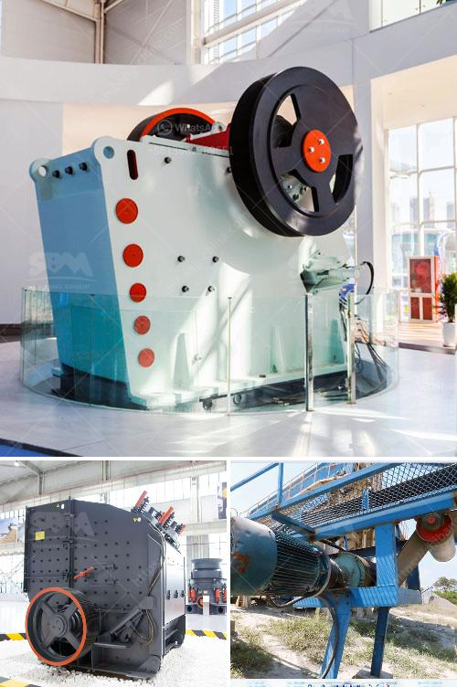

<h3>closed of all crushing plant</h3>
In recent years, there has been a growing concern about the detrimental effects of industrial activities on the environment. As a result, the closure of crushing plants has become a worldwide trend. Crushing plants are industrial facilities used to process limestone, gravel, and other aggregates for construction purposes. While they play a vital role in the construction industry, it is crucial to reassess their impact on the environment. This article explores the reasons behind the closure of crushing plants and how it is a turning point in environmental conservation.

One of the major reasons for the closure of crushing plants is the negative impact they have on air quality. These plants emit a significant amount of dust and particulate matter during the crushing and screening processes, causing air pollution that can harm human health and surrounding ecosystems. Closing down such facilities not only improves air quality but also aligns with global efforts to combat climate change and protect the environment.

Crushing plants require a substantial amount of water for their operations, resulting in high water consumption. Many regions around the world already struggle with water scarcity, and the excessive use of water by these plants exacerbates the problem. Additionally, the discharge of wastewater containing pollutants from crushing plants can contaminate nearby water bodies, impacting aquatic life. Shutting down these plants helps conserve water resources and safeguards the integrity of our ecosystems.

Crushing plants often operate in areas that are rich in biodiversity. These ecosystems support diverse plant and animal species. The extraction of aggregates and the associated activities involved in crushing plants can disrupt habitats, leading to the loss of biodiversity. By closing down these facilities, we can preserve delicate ecosystems and protect endangered species. It marks a crucial step towards achieving a balance between industrial growth and environmental sustainability.

The closure of crushing plants is not only an effort to mitigate the environmental impact but also an opportunity to transition to more sustainable alternatives. Advancements in technology have paved the way for cleaner and more efficient crushing processes. Innovative solutions, like using electric-powered machinery or integrating dust suppression systems, reduce the environmental footprint of these operations. By investing in sustainable alternatives, we can improve efficiency while minimizing the negative repercussions on the environment.

While the closure of crushing plants may have economic implications for the industry, it is crucial to strike a balance between economic growth and environmental stewardship. Governments and stakeholders must work together to find alternatives and support workers affected by plant closures. Investing in training programs and encouraging the adoption of environmentally friendly practices can help the industry transition towards a more sustainable and responsible approach.

The closure of crushing plants signifies a turning point in environmental conservation efforts. By acknowledging the negative impacts of these facilities on air quality, water resources, and biodiversity, we have taken a critical step towards a more sustainable future. Transitioning to cleaner alternatives while ensuring the well-being of affected communities is key. Let us embrace this opportunity to protect our environment and establish a blueprint for a greener tomorrow.
<h3>Contact us</h3><ul><li><strong>Whatsapp:&nbsp;<a href="https://wa.me/8613661969651">+8613661969651</a></strong></li><li><a href="https://swt.shibang-china.com/?git&amp;zhl&amp;closed of all crushing plant"><strong>Online Service(chat now)</strong></a></li></ul><h3>Related</h3><ul><li><a href='ball mills machine.md'>ball mills machine</a></li><li><a href='ball coal crusher industries.md'>ball coal crusher industries</a></li><li><a href='used conical crushers for sale.md'>used conical crushers for sale</a></li><li><a href='gold wash plant turkey manufacturer.md'>gold wash plant turkey manufacturer</a></li><li><a href='single cylinder hydraulic cone crusher.md'>single cylinder hydraulic cone crusher</a></li></ul>