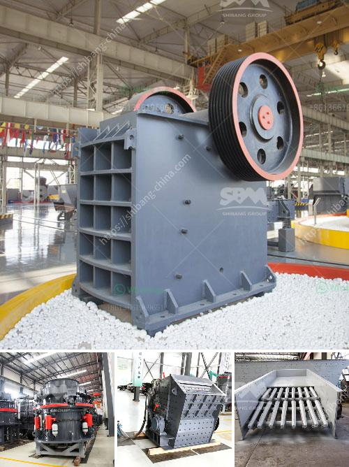

<h3>closs size setting jaw crusher</h3>
Setting the jaw crusher's closeness size is an essential task to ensure efficient and effective operation of the machine. The closeness size determines the output size of the material and its subsequent uses. Therefore, it is crucial to select the appropriate gap setting for the specific material being crushed.

The closeness size of a jaw crusher refers to the distance between the two jaw plates at the bottom of the crushing chamber. This gap determines the size of the crushed material. The smaller the gap, the finer the output size, and vice versa. The closeness size setting can be adjusted manually or automatically depending on the crusher's design and specifications.

To determine the best closeness size setting for a jaw crusher, several factors need to be considered. These factors include the type and hardness of the material, feed size, desired output size, and the crusher's capacity. The following steps can help optimize the closeness size setting for maximum efficiency and productivity:

1. Determine the material's characteristics: Before setting the jaw crusher's closeness size, it is important to understand the material's properties. The hardness, abrasiveness, and compressive strength of the material can influence the selection of the optimal setting.

2. Adjust the feed size: The feed size of the material entering the crusher chamber affects the closeness size setting. Generally, smaller feed sizes require narrower closeness sizes, while larger feed sizes can tolerate wider closeness sizes. By adjusting the feed size, the optimal setting can be achieved for the desired output size.

3. Consider the desired output size: The closeness size setting should be selected based on the desired final product size. If a finer output size is required, a narrower closeness size setting is recommended. On the other hand, if a coarser output size is acceptable, a wider closeness size setting can be chosen.

4. Check the crusher's capacity: The crusher's capacity should also be considered when setting the closeness size. A smaller gap setting may increase the risk of overloading the crusher if the material volume exceeds its capacity. It is crucial to strike a balance between the desired output size and the crusher's capacity.

5. Regularly monitor and adjust: Once the closeness size setting is determined, it is essential to monitor the crusher's performance regularly. By analyzing the output size and adjusting the gap setting if necessary, operators can optimize the crusher's efficiency and productivity.

In conclusion, setting the closeness size of a jaw crusher is a critical process in achieving the desired final product size. By considering the material's properties, desired output size, and crusher's capacity, operators can select the optimal setting for maximum efficiency and productivity. Regular monitoring and adjustment ensure consistent performance and minimize the risk of overloading the crusher.
<h3>Contact us</h3><ul><li><strong>Whatsapp:&nbsp;<a href="https://wa.me/8613661969651">+8613661969651</a></strong></li><li><a href="https://swt.shibang-china.com/?git&amp;zhl&amp;closs size setting jaw crusher"><strong>Online Service(chat now)</strong></a></li></ul><h3>Related</h3><ul><li><a href='quartz powder machine manufacturer in india.md'>quartz powder machine manufacturer in india</a></li><li><a href='crusher stone price bolivia.md'>crusher stone price bolivia</a></li><li><a href='lay out calcium carbonate plant.md'>lay out calcium carbonate plant</a></li><li><a href='quarry crusher machine usa.md'>quarry crusher machine usa</a></li><li><a href='stone crusher mini.md'>stone crusher mini</a></li></ul>