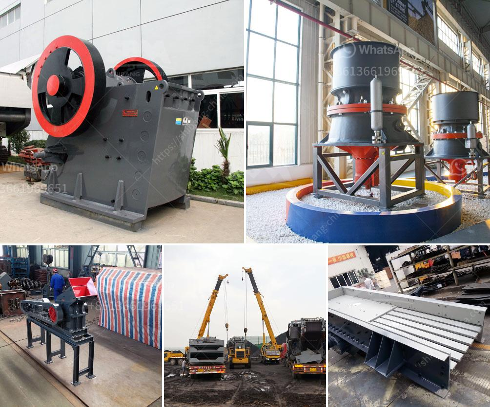

<h3>coal crusher 350tph</h3>
Coal crusher is widely used in the coal crushing process. As technology developed, now we have many types of coal crushers, including jaw crusher, cone crusher, impact crusher and portable crushing and screening plant. SBM supply a whole set of coal crushing production line to coal processing industry.

Coal mill is the most important coal processing plant as coal is usually fed into fire power plant to generate energy. SBM vertical coal mill is the one we designed for coal pulverizing and is featured with high capacity, high efficiency and long service time.

Coal crusher and coal mill: They are used for crushing and grinding coal into powder in cement production line. SBM offer types of coal crusher and coal mill for crushing coal.

Jaw crusher is used as primary crushing equipment in coal processing plants, which is composed of movable jaw and static jaw. It will simulate the movement of animals when the two jaws move to crush materials.

When the mobile jaw plate rises, the angle between elbow plate and mobile jaw plate becomes larger. So the mobile jaw plate will be close to the fixed jaw plate and at the same time, the material can be crushed. When the mobile jaw plate down, the angle between elbow plate and the movable jaw becomes small, and under the action of rod and spring, the movable jaw becomes smaller, thus the crushed materials are discharged from the outlet.

SBM has produced various kinds of crushers to fulfill different clients' production needs. Jaw crusher, cone crusher, impact crusher, VSI crusher and hammer crusher is the main equipment in stone crusher plant. The vibrating feeder takes the raw materials into jaw crusher for the first crushing process. The big block materials will be crushed into small size. With cone crusher or impact crusher, the materials will be crushed into fine size. VSI crusher is used to crush the relative hard materials. In the whole production line, it needs the auxiliary equipment to finish the whole processing, such as the vibrating feeder, vibrating screen, belt conveyor, etc.
<h3>Contact us</h3><ul><li><strong>Whatsapp:&nbsp;<a href="https://wa.me/8613661969651">+8613661969651</a></strong></li><li><a href="https://swt.shibang-china.com/?git&amp;zhl&amp;coal crusher 350tph"><strong>Online Service(chat now)</strong></a></li></ul><h3>Related</h3><ul><li><a href='what is the dam ring in vertical rollers mill.md'>what is the dam ring in vertical rollers mill</a></li><li><a href='ball mills for mining of 5000 tons per hour.md'>ball mills for mining of 5000 tons per hour</a></li><li><a href='crusher in china.md'>crusher in china</a></li><li><a href='clay processing technology.md'>clay processing technology</a></li><li><a href='difference between residual and transported soil.md'>difference between residual and transported soil</a></li></ul>