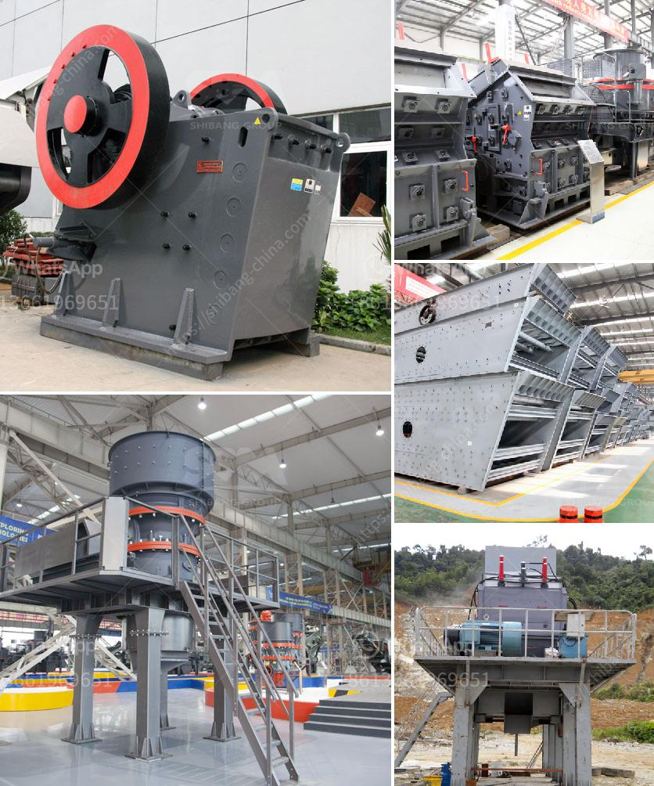

<h3>coal crusher for sale in south africa</h3>
Coal, a fossil fuel power resource, plays a crucial role in the global energy industry. Since it is primarily utilized in power generation, its demand has been increased rapidly over the past decade. As a result, coal crusher machine is also in highly demand by many enterprises in Africa, especially in South Africa.

Coal crusher, also known as double stage crusher, is a highly efficient crushing equipment. It is a new type of equipment developed for the coal industry, and it mainly crushes high moisture coal. Besides, it is mainly used to crush coal cinder, slag, shale, coal gangue and other materials. And it can be applied to building material, highway, railway, mining and other industries.

This type of crusher is suitable for crushing various brittle materials with compressive strength less than 150 MPa, humidity less than 10%, such as limestone, coal, salt, gypsum, alum, brick, tile, coal gangue and so on. Therefore, it is the ideal coal crusher machine for the primary crushing purpose.

Moreover, the coal crusher for sale can also provide coal crushing solution for coal industry, like coal gangue and coal cinder, and it is driven by hydraulic pressure, which greatly reduces the bearing load, achieves the stable operation and makes the machine work smoothly.

Coal crusher for sale in South Africa is the necessary equipment for field force and underground mining. Underway, coal crusher for sale in South Africa is help customer decrease huge economic value loss caused by strategic factors, making coal preparation plant achieve stable situation in South Africa economically.

However, it is worth to mention that the crushing process of coal before raw coal storage is often adopted in coal preparation construction projects. For example, the feeding material size of 100mm, the required product size of 12mm, etc. A coal crusher machine is designed to reduce large rocks into smaller rocks, gravel, or rock dust. Crushers may be used to reduce the size, or change the form, of waste materials so they can be more easily disposed of or recycled, or to reduce the size of a solid mix of raw materials (as in rock ore), so that pieces of different composition can be differentiated.
<h3>Contact us</h3><ul><li><strong>Whatsapp:&nbsp;<a href="https://wa.me/8613661969651">+8613661969651</a></strong></li><li><a href="https://swt.shibang-china.com/?git&amp;zhl&amp;coal crusher for sale in south africa"><strong>Online Service(chat now)</strong></a></li></ul><h3>Related</h3><ul><li><a href='komatsu crawler jaw crusher.md'>komatsu crawler jaw crusher</a></li><li><a href='portable limestone crushing systems.md'>portable limestone crushing systems</a></li><li><a href='roller mill malaysia.md'>roller mill malaysia</a></li><li><a href='barite machinery production plant.md'>barite machinery production plant</a></li><li><a href='vertical shaft impact crusher technical specifications.md'>vertical shaft impact crusher technical specifications</a></li></ul>