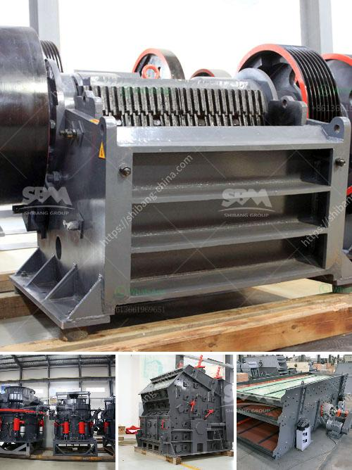

<h3>coal crusher for sale</h3>
Coal, a reliable and affordable source of energy for centuries, has been used to power industries, homes, and vehicles. However, the need for cleaner and more sustainable energy sources is becoming increasingly crucial, as the environmental impact of burning coal is well-documented. As a result, the demand for coal crushers, machines designed to break down coal into smaller sizes, has increased.

A coal crusher is a piece of equipment used to crush coal into smaller-sized pieces for a variety of applications. Crushing coal to size enables efficient combustion of coal and reduces its harmful emissions, making it an essential process in many modern industries. With the advancement of technology, coal crushers can be widely used in a variety of crushing and screening applications.

When selecting a coal crusher for sale, buyers should consider various factors to ensure they choose one that best suits their specific needs. Firstly, the maximum feed size of the crusher should be determined to ensure it can handle the desired coal size. Additionally, the output size and capacity need to be considered in order to meet production requirements.

Another aspect that should be taken into account is the type of crusher. Common types of coal crushers include jaw crushers, impact crushers, and cone crushers. Jaw crushers are primarily used for coarse crushing, while impact and cone crushers are commonly used for secondary and tertiary crushing. Each type of crusher has its own advantages and disadvantages, depending on the specific application.

Furthermore, the overall build quality and durability of the coal crusher should be evaluated. High-quality crushers are often more efficient, reliable, and require less maintenance, contributing to lower overall operating costs.

To find a coal crusher for sale, potential buyers can search online or consult with reputable industrial equipment suppliers. It is recommended to request detailed information about the crusher's specifications, performance, and warranty. Additionally, reading customer reviews and comparing prices from multiple sellers can help buyers make a well-informed purchase decision.

In conclusion, the demand for coal crushers is on the rise due to the need for cleaner and more sustainable energy sources. When seeking a coal crusher for sale, buyers should consider factors such as feed size, output size, capacity, and type of crusher. It is crucial to choose a high-quality crusher that meets specific requirements and offers long-lasting performance.
<h3>Contact us</h3><ul><li><strong>Whatsapp:&nbsp;<a href="https://wa.me/8613661969651">+8613661969651</a></strong></li><li><a href="https://swt.shibang-china.com/?git&amp;zhl&amp;coal crusher for sale"><strong>Online Service(chat now)</strong></a></li></ul><h3>Related</h3><ul><li><a href='vibrating screen manufacturers.md'>vibrating screen manufacturers</a></li><li><a href='limestone production mining equipment for sale.md'>limestone production mining equipment for sale</a></li><li><a href='copper ore machine in china.md'>copper ore machine in china</a></li><li><a href='feldspar grinding machine.md'>feldspar grinding machine</a></li><li><a href='maize grinding mill in philippines south africa.md'>maize grinding mill in philippines south africa</a></li></ul>