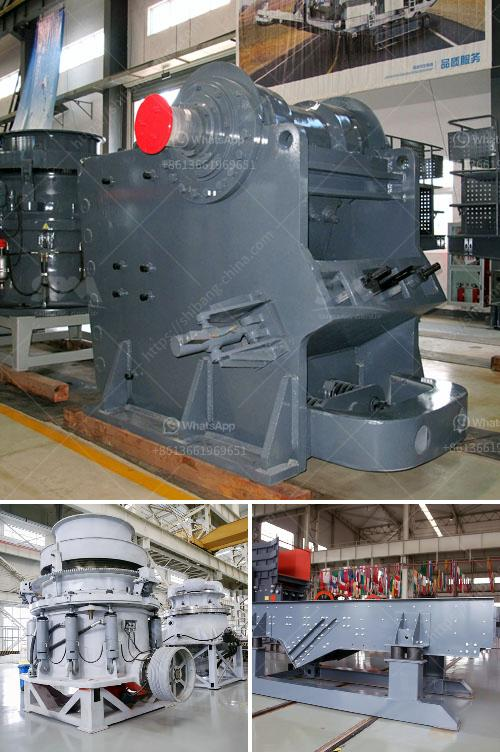

<h3>coal crusher supplier</h3>
Coal, a fossil fuel, is the largest source of energy for the generation of electricity worldwide. This versatile fuel is also used for industrial purposes such as refining metals, cement manufacturing, and chemical production. One essential aspect of coal processing is crushing, and there are numerous equipment options available to facilitate this task.

When it comes to coal crushing, choosing the right supplier is crucial to ensure the process runs smoothly. Supplier selection plays a significant role since it determines the quality and reliability of the equipment, as well as the level of support and post-sales services provided.

A reliable and reputable coal crusher supplier weaves an intricate web of trust to establish a long-term partnership. As a leading entity in the industry, JXSC Mine Machinery has been firmly committed to the development and manufacturing of coal crushers for decades. By combining advanced technology and years of experience, JXSC Mine Machinery has made significant strides in supplying quality coal crushers that are widely appreciated and highly sought-after worldwide.

JXSC Mine Machinery coal crushers include roller crushers, hammer crushers, jaw crushers, and mobile crushers. These crushers effectively crush various types of coal, ensuring consistent and high-quality final products. With thorough knowledge and understanding of the industry, JXSC Mine Machinery provides customized solutions to suit the specific requirements of different coal processing plants.

The coal crusher suppliers at JXSC Mine Machinery are dedicated to delivering reliable, high-quality coal crushing and screening equipment, ensuring a smooth and efficient operation of your plant. From individual machines to complete coal crushing systems, JXSC Mine Machinery offers robust and reliable equipment that can handle even the most demanding applications.

Investing in a reliable coal crusher supplier like JXSC Mine Machinery will ensure that you achieve maximum productivity while minimizing operating costs. Their extensive range of equipment combined with their expertise and exceptional customer service make them a trusted partner for coal processing plants worldwide. Whether you require a single machine or a complete coal crushing system, JXSC Mine Machinery has the solution to fulfill your needs and exceed your expectations.
<h3>Contact us</h3><ul><li><strong>Whatsapp:&nbsp;<a href="https://wa.me/8613661969651">+8613661969651</a></strong></li><li><a href="https://swt.shibang-china.com/?git&amp;zhl&amp;coal crusher supplier"><strong>Online Service(chat now)</strong></a></li></ul><h3>Related</h3><ul><li><a href='cement plant machinery manufacturers in coimbatore.md'>cement plant machinery manufacturers in coimbatore</a></li><li><a href='marble crusher machine.md'>marble crusher machine</a></li><li><a href='coal grinding mill in india.md'>coal grinding mill in india</a></li><li><a href='coal processing plants south africa.md'>coal processing plants south africa</a></li><li><a href='organic fertilizer production line in india.md'>organic fertilizer production line in india</a></li></ul>