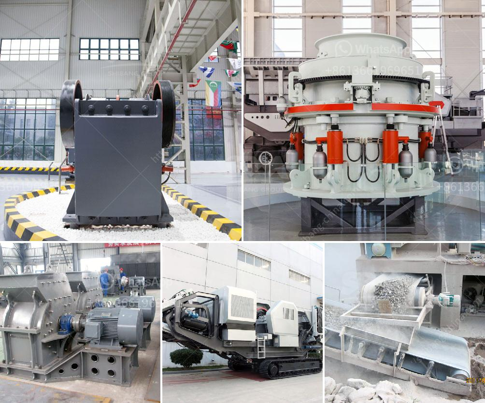

<h3>coal grinding mill in india</h3>
Coal is an essential raw material in India's energy sector. It provides about 75% of the country's total power generation. India is also the second-largest consumer of thermal coal globally, with a huge demand for coal grinding mills. This article explores the significance of coal grinding mills in India and their contribution to the country's power generation.

Coal grinding mills are vital tools which are used to pulverize coal into fine powder for use in various applications. The operational efficiency of a coal grinding mill directly affects the performance and profitability of a coal-fired power plant. That is why the availability of efficient, high-quality coal grinding mills is essential in India.

India has a large reserve of coal, which makes it an abundant resource for power generation. However, the coal obtained from mines needs to be crushed and ground into fine particles before being used in power plants. Coal grinding mills play a crucial role in this process.

Coal grinding mills in India are quite diversified and different types exist. Depending on the coal characteristics and desired end product, coal grinding mills can be divided into ball mills, vertical roller mills, and Raymond mills. Among these types, ball mills have been widely used due to their low cost, energy consumption, and easy maintenance.

Coal grinding mills can process a range of coals, including lignite, bituminous coal, anthracite, and petroleum coke. With the expansion of coal-based thermal power plants, the demand for coal grinding mills has increased in fuel preparation and pulverized coal injection systems.

The grinding mills designed and manufactured in India are widely used in the Indian coal industry. Customers can choose a variety of coal grinding mills based on their production capacity and design features. These mills are cost-effective and extremely efficient, ensuring high-quality pulverized coal for power generation.

In conclusion, coal grinding mills play a crucial role in India's energy sector. They are essential for pulverizing coal into fine particles for use in power plants. With the increasing demand for coal-based power generation, efficient and reliable coal grinding mills are crucial for sustainable energy production in India.
<h3>Contact us</h3><ul><li><strong>Whatsapp:&nbsp;<a href="https://wa.me/8613661969651">+8613661969651</a></strong></li><li><a href="https://swt.shibang-china.com/?git&amp;zhl&amp;coal grinding mill in india"><strong>Online Service(chat now)</strong></a></li></ul><h3>Related</h3><ul><li><a href='small concrete crushers for low capacity.md'>small concrete crushers for low capacity</a></li><li><a href='sample business plan for stone crusher in bolivia.md'>sample business plan for stone crusher in bolivia</a></li><li><a href='how much investment needed to start a crusher in canada.md'>how much investment needed to start a crusher in canada</a></li><li><a href='operation of stone crushing plant.md'>operation of stone crushing plant</a></li><li><a href='mining crusher plant limestone process.md'>mining crusher plant limestone process</a></li></ul>