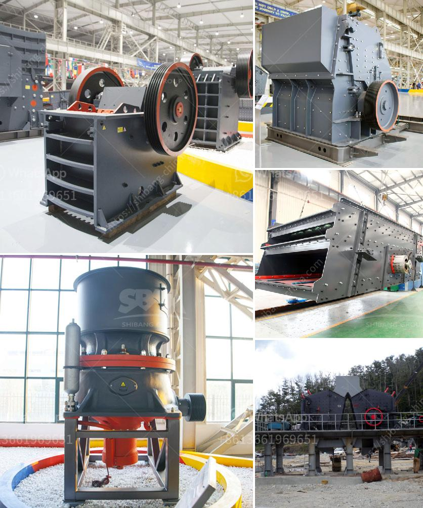

<h3>coal handling plant maintenance pdf</h3>
A coal handling plant, or CHPP, is a facility that washes coal of soil and rock, crushes it into graded sized chunks, and stockpiles grades of coal to prepare it for transport to market. The efficiency and quality of a coal handling plant directly impact the reliability, performance, and cost efficiency of the entire coal power generation process. Therefore, proper maintenance of a coal handling plant is vital to maximize its operational effectiveness and minimize downtime.

Maintenance of a coal handling plant involves a range of activities, including regular inspections, preventive maintenance, and repairs. The goal of maintenance is to ensure that all equipment and systems within the plant are functioning optimally and that any potential issues are addressed promptly to avoid major failures. A comprehensive maintenance plan for a coal handling plant typically includes the following key components:

1. Regular inspections: Regular inspections help identify potential issues and early warning signs of equipment failure. Inspections should be conducted on a scheduled basis and cover all major components of the coal handling plant, such as conveyors, crushers, pulverizers, and screens. Inspections should also include testing and monitoring of key parameters, such as vibration, temperature, and lubrication levels.

2. Preventive maintenance: Preventive maintenance involves performing routine maintenance tasks on equipment to prevent failures before they occur. This includes activities such as lubrication, tightening of connections, belt alignment, and cleaning. Preventive maintenance tasks should be scheduled and performed based on manufacturer recommendations and industry best practices.

3. Equipment repairs: Equipment repairs are necessary when components fail or degrade over time. Repairs can include replacing worn-out parts, repairing damaged equipment, and restoring performance to its original state. Proper documentation and tracking of repairs is essential to maintain an accurate maintenance history and identify recurring issues that may require additional attention.

4. Emergency maintenance: Despite preventive measures, emergencies can occur that require immediate attention and repair. Emergency maintenance should be planned for and include measures such as having spare parts readily available, maintaining an emergency response team, and establishing clear communication channels for reporting and addressing urgent issues.

The importance of adhering to a comprehensive maintenance plan for a coal handling plant cannot be overstated. Regular inspections and preventive maintenance help identify and address small issues before they escalate into major failures that could result in significant downtime and costly repairs. A well-maintained coal handling plant also promotes efficient coal supply, reduces energy consumption, and minimizes environmental impact.

To facilitate effective maintenance of coal handling plants, various resources are available, including PDF guides and manuals. These documents provide detailed information on maintenance procedures, best practices, and troubleshooting guidelines specific to coal handling plants. They serve as a valuable reference for maintenance personnel, enabling them to perform tasks efficiently and effectively.

In conclusion, proper maintenance of a coal handling plant is indispensable for ensuring its efficient and reliable operation. A comprehensive maintenance plan, consisting of regular inspections, preventive maintenance, and repairs, is essential to identify and address potential issues in a timely manner. The availability of PDF resources further supports the maintenance efforts by providing valuable guidance and information. By implementing and following a well-defined maintenance plan, coal handling plants can enhance their performance, reduce downtime, and contribute to a sustainable energy future.
<h3>Contact us</h3><ul><li><strong>Whatsapp:&nbsp;<a href="https://wa.me/8613661969651">+8613661969651</a></strong></li><li><a href="https://swt.shibang-china.com/?git&amp;zhl&amp;coal handling plant maintenance pdf"><strong>Online Service(chat now)</strong></a></li></ul><h3>Related</h3><ul><li><a href='fly ash grinding machine manufacturar in india.md'>fly ash grinding machine manufacturar in india</a></li><li><a href='raymond grinder mill pakistan.md'>raymond grinder mill pakistan</a></li><li><a href='buy crusher of jaw.md'>buy crusher of jaw</a></li><li><a href='gold ore crusher machine.md'>gold ore crusher machine</a></li><li><a href='grinding machine for quartz stone.md'>grinding machine for quartz stone</a></li></ul>