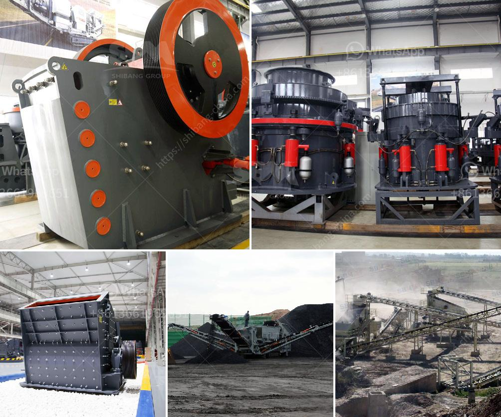

<h3>coal mill manufacturers</h3>
Coal mill manufacturers play a crucial role in the coal-fired power generation process. They design, manufacture, and sell equipment specifically for coal mills, which are used to grind the coal into fine powder. This powder is then used as fuel in the boilers to generate electricity.

Coal mills are an essential component of a coal-fired plant as they help in generating the desired quality of steam that is used for efficient power generation. A well-designed and efficient coal mill can grind the coal with high efficiency and achieve the desired particle size distribution.

There are several manufacturers in the market that specialize in coal mill manufacturing. These manufacturers have years of experience in designing and manufacturing coal milling equipment. They understand the intricacies of coal grinding and the requirements of coal-fired power plants.

To ensure optimal performance, coal mill manufacturers use high-quality materials and advanced manufacturing techniques. They incorporate advanced features in their mills, such as improved grinding efficiency, enhanced drying capabilities, and accurate control systems. These features help in maximizing the output and efficiency of the coal mill, resulting in better power generation.

In addition to manufacturing coal mills, these manufacturers also provide related services like installation, commissioning, and maintenance. They have a team of experts who can guide power plant operators in selecting the right coal mill for their specific requirements. They also offer regular maintenance and repair services to ensure smooth and trouble-free operation of the coal mills.

With the increasing demand for clean and sustainable energy, coal mill manufacturers are continuously investing in research and development to make their equipment more efficient and environmentally friendly. They are exploring alternative technologies like biomass co-firing and carbon capture to reduce the environmental impact of coal-fired power plants.

In conclusion, coal mill manufacturers are an integral part of the coal power generation industry. Their expertise in designing and manufacturing efficient coal mills plays a crucial role in achieving optimal power generation. With their advanced equipment and services, they contribute to the development of cleaner and more sustainable energy solutions.
<h3>Contact us</h3><ul><li><strong>Whatsapp:&nbsp;<a href="https://wa.me/8613661969651">+8613661969651</a></strong></li><li><a href="https://swt.shibang-china.com/?git&amp;zhl&amp;coal mill manufacturers"><strong>Online Service(chat now)</strong></a></li></ul><h3>Related</h3><ul><li><a href='design calculations of rotary dryer.md'>design calculations of rotary dryer</a></li><li><a href='mobile aggregate plant for sale in the philippines.md'>mobile aggregate plant for sale in the philippines</a></li><li><a href='roller raymond mill.md'>roller raymond mill</a></li><li><a href='jaw concrete crusher price.md'>jaw concrete crusher price</a></li><li><a href='powder crushing machine making.md'>powder crushing machine making</a></li></ul>