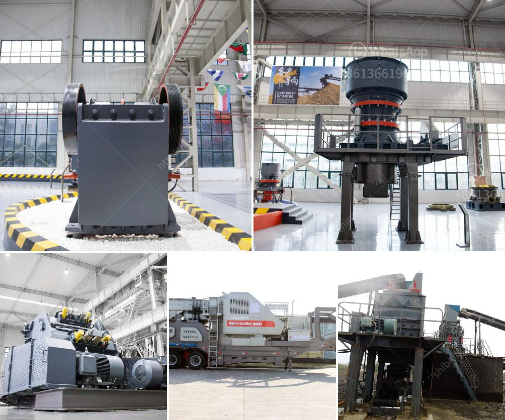

<h3>coal mine equipment manufacturer of india</h3>
Coal mining in India has a long history, dating back to the 1770s when the first commercial coal mine was opened in Raniganj, West Bengal. Over the years, coal mining has become an integral part of the country's energy sector, providing a substantial portion of its power requirements. To cater to the growing demand for coal, coal mine equipment manufacturers in India have played a crucial role in supplying high-quality equipment and machinery.

One prominent coal mine equipment manufacturer in India is Eimco Elecon. They are known for providing technologically advanced equipment that ensures safe and efficient coal extraction. The company specializes in manufacturing a wide range of coal mining equipment, such as roof bolting machines, continuous miners, feeder breakers, shuttle cars, and underground haulage systems.

Eimco Elecon's roof bolting machines are designed to provide support and stability to the mine roof, preventing accidents caused by roof collapses. These machines are equipped with advanced features like wireless communication, remote control, and automated drilling systems, making them highly reliable and efficient.

Continuous miners are another crucial equipment manufactured by Eimco Elecon. These machines are used for cutting and loading coal simultaneously, enabling continuous and uninterrupted mining operations. Continuous miners are highly versatile and can be used in various mining conditions, making them an essential tool for coal mining.

Feeder breakers are yet another important equipment developed by Eimco Elecon. These machines are used to break large coal lumps into smaller sizes, which can then be easily transported and processed. Feeder breakers not only improve the efficiency of coal handling but also ensure a constant feed rate to the conveyor systems, preventing blockages and enhancing overall productivity.

Shuttle cars manufactured by Eimco Elecon are extensively used for transportation of coal and other materials within the mine. These robust machines are equipped with advanced features like hydraulic steering, water-cooled brakes, and ergonomic designs, making them highly reliable and operator-friendly.

Eimco Elecon is also known for its highly efficient underground haulage systems. These systems are designed to transport coal and other materials from the face of the mine to the surface efficiently and safely. The company offers a range of haulage systems, including chain conveyors and belt conveyors, tailored to suit the specific needs of different coal mines.

Apart from Eimco Elecon, other coal mine equipment manufacturers in India also contribute significantly to the growth of the industry. These manufacturers have made significant investments in research and development to improve the design and functionality of their equipment, ensuring maximum productivity and safety in coal mining operations.

In conclusion, coal mine equipment manufacturers in India have played a crucial role in meeting the growing demands of the country's coal mining industry. Companies like Eimco Elecon have introduced technologically advanced and reliable equipment that ensures efficient and safe coal extraction. The continuous innovation and development by these manufacturers have not only boosted the coal mining sector but also contributed to the overall growth of the Indian economy.
<h3>Contact us</h3><ul><li><strong>Whatsapp:&nbsp;<a href="https://wa.me/8613661969651">+8613661969651</a></strong></li><li><a href="https://swt.shibang-china.com/?git&amp;zhl&amp;coal mine equipment manufacturer of india"><strong>Online Service(chat now)</strong></a></li></ul><h3>Related</h3><ul><li><a href='ball mill ghana in zambia.md'>ball mill ghana in zambia</a></li><li><a href='cone crusher price in china.md'>cone crusher price in china</a></li><li><a href='marble granite stone grinding machine price.md'>marble granite stone grinding machine price</a></li><li><a href='ball mill for silica sand.md'>ball mill for silica sand</a></li><li><a href='10 conveyor belt operating.md'>10 conveyor belt operating</a></li></ul>