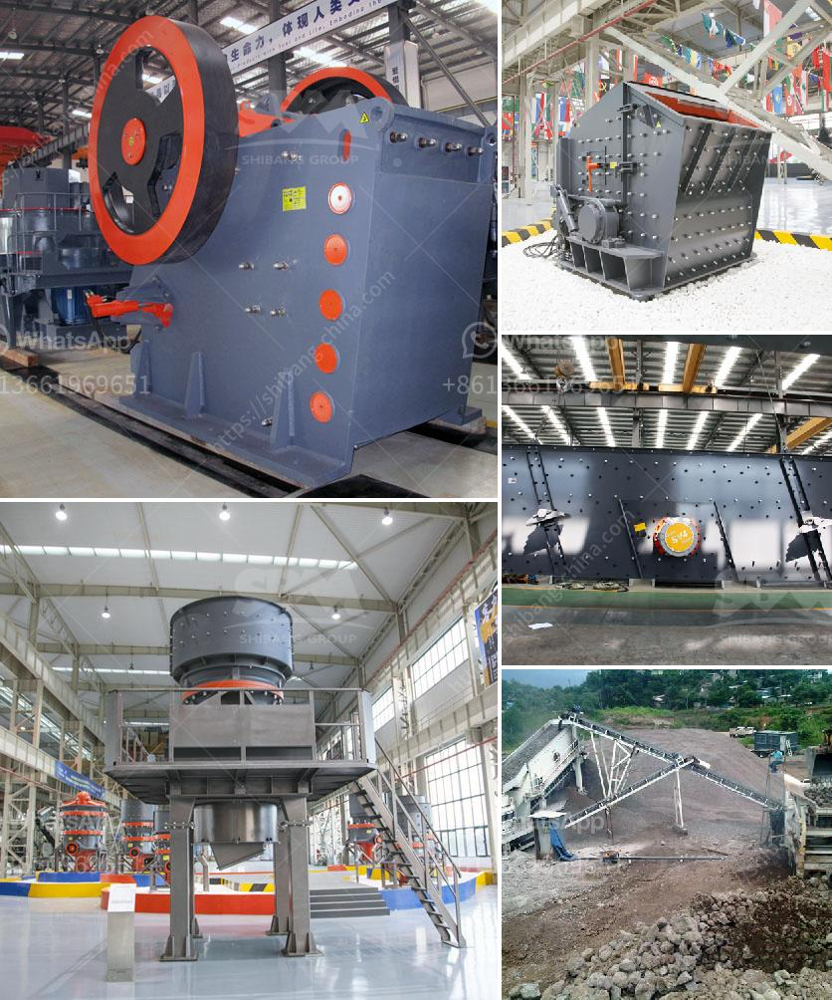

<h3>coal mining crusher malaysia</h3>
Coal mining crusher malaysia is generally used for coal crushing. The coal mines in Malaysia are primarily focused on the mining and subsequent crushing of steam coal. Coal mining operations in Malaysia have drastically declined in recent years due to numerous factors, including declining coal prices, strict regulations, and competition from alternative energy sources.

However, despite the declining numbers, Malaysia remains a significant coal producer in the region. The country's proven coal reserves are considerable and have the potential to be exploited further. These coal reserves are mainly located in the states of Sarawak and Sabah on the island of Borneo.

Coal mining crusher in Malaysia plays a crucial role in the energy sector. As coal is the most abundant fossil fuel in the world, it is widely used for power generation and industrial applications. The coal mining industry in Malaysia involves the extraction, processing, and transportation of coal deposits, where crushers are used as the initial step in coal processing.

Coal crushers are designed to handle large amounts of coal efficiently and systematically. They are capable of processing coal of various sizes and compositions, reducing it to a uniform size suitable for combustion in boilers. Crushers used in coal mining operations in Malaysia are typically large machines that require specialized maintenance and care.

However, the declining demand for coal and increasing focus on renewable energy sources pose significant challenges for the coal mining industry in Malaysia. With a rising global awareness of the environmental impact of coal consumption, the future of coal mining crusher in Malaysia remains uncertain.

In conclusion, coal mining crusher in Malaysia is an essential part of the country's energy mix, but it faces challenges due to declining demand and the shift towards renewable energy sources. The industry must adapt to these shifting trends and explore new opportunities for sustainable coal mining practices.
<h3>Contact us</h3><ul><li><strong>Whatsapp:&nbsp;<a href="https://wa.me/8613661969651">+8613661969651</a></strong></li><li><a href="https://swt.shibang-china.com/?git&amp;zhl&amp;coal mining crusher malaysia"><strong>Online Service(chat now)</strong></a></li></ul><h3>Related</h3><ul><li><a href='300tpd cement plant cost in india.md'>300tpd cement plant cost in india</a></li><li><a href='gold processing leaching plant.md'>gold processing leaching plant</a></li><li><a href='second hand ball mill and gauteng.md'>second hand ball mill and gauteng</a></li><li><a href='coal powder making process.md'>coal powder making process</a></li><li><a href='turnkey consultant for calcium carbonate plant in india.md'>turnkey consultant for calcium carbonate plant in india</a></li></ul>