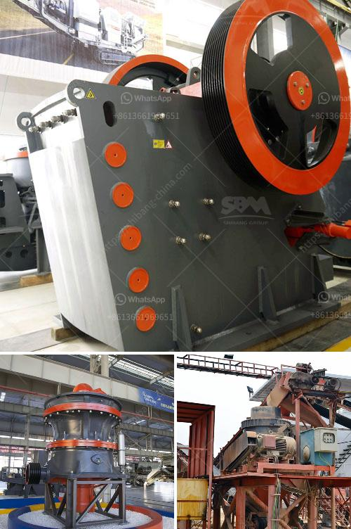

<h3>coal mining machines for sale</h3>
Coal mining has been an essential part of the industrial revolution since its inception. With the advent of technology, the mining techniques have evolved, making the process more efficient. One crucial aspect of modern coal mining is the utilization of advanced machinery. These cutting-edge machines have revolutionized the mining process, enhancing productivity and safety. In this article, we will delve into the world of coal mining machines for sale and highlight their significance in the industry.

Coal mining machines are designed to extract coal deposits from the Earth's crust efficiently. These brilliant pieces of equipment come in various sizes and types to suit different mining operations. The most common types of coal mining machines are continuous miners, longwall miners, and draglines.

Continuous miners are robust machines that play a vital role in the underground mining process. These machines are equipped with cutting heads that rotate and break the coal from the rock face. They consist of a conveyor system that carries the coal to the surface. Continuous miners are especially effective in narrow coal seams because of their ability to operate in confined spaces.

Longwall mining machines are often used in underground coal mines. This method is highly efficient for extracting large coal deposits in a systematic manner. Longwall miners use a shearing technique that cuts and removes coal from the face in one continuous motion. This process leaves behind a smooth, flat surface, reducing the risk of potential cave-ins. Longwall mining machines are equipped with hydraulic systems that provide the necessary force for cutting and moving coal.

Draglines, on the other hand, are massive machines utilized in open-cut coal mines. They are known for their size and power, making them an impressive sight to behold. Draglines are equipped with a large bucket and a boom arm that can reach 100 meters or more. These machines are capable of removing vast amounts of overburden material to expose the coal deposit beneath. They are particularly useful in extracting coal from deep mines, where access might otherwise be challenging.

The advancements in coal mining machines have significantly improved safety conditions for miners. Automation technology has allowed for remote control and even autonomous operation of these machines, reducing the need for human presence in hazardous environments. Additionally, modern machines are equipped with advanced safety features, such as sensors that detect gas leaks and other potential risks.

When seeking coal mining machines for sale, it is crucial to consider various factors. Firstly, the specific mining requirements must be evaluated. The size of the coal deposit, mining method, and geological conditions play a significant role in determining the suitable machine. Secondly, it is essential to assess the machine's reliability, durability, and maintenance requirements. Investing in a high-quality, well-maintained machine will ensure its longevity and optimal performance.

Fortunately, numerous reputable dealers and manufacturers offer coal mining machines for sale. It is advisable to conduct thorough research, compare prices, and read customer reviews before making a purchase. Additionally, consulting with industry experts and experienced miners can provide valuable insights into selecting the right machine for a specific mining operation.

In conclusion, coal mining machines have tremendously transformed the mining industry. With continuous miners, longwall miners, and draglines, the mining process has become more efficient and safer. These machines have immensely contributed to increasing productivity while minimizing human labor in hazardous environments. When considering coal mining machines for sale, careful consideration of mining requirements and machine specifications are essential. By investing in reliable, high-quality machinery, mining operators can ensure a profitable and safe coal mining operation.
<h3>Contact us</h3><ul><li><strong>Whatsapp:&nbsp;<a href="https://wa.me/8613661969651">+8613661969651</a></strong></li><li><a href="https://swt.shibang-china.com/?git&amp;zhl&amp;coal mining machines for sale"><strong>Online Service(chat now)</strong></a></li></ul><h3>Related</h3><ul><li><a href='stone crusher in germany.md'>stone crusher in germany</a></li><li><a href='impact crusher for sale philippines.md'>impact crusher for sale philippines</a></li><li><a href='stone crusher machine price in bangladesh.md'>stone crusher machine price in bangladesh</a></li><li><a href='what is the dam ring in vertical rollers mill.md'>what is the dam ring in vertical rollers mill</a></li><li><a href='lime powder production equipment.md'>lime powder production equipment</a></li></ul>