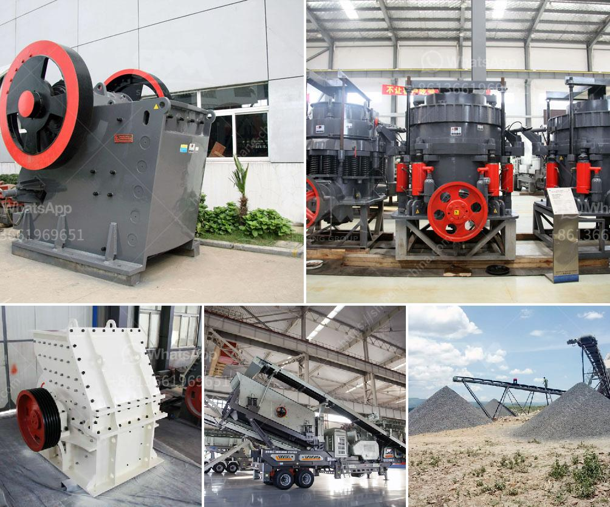

<h3>coal powder making process</h3>
Coal powder is a versatile and essential resource in industries such as energy production, cement manufacturing, and steel production. The pulverization of coal into fine particles ensures the proper combustion of this fuel in power plants and other industrial facilities. This article will discuss the process of coal powder making, highlighting its importance and the steps involved.

The coal powder making process starts with the extraction of raw coal from coal mines. Depending on the variety and quality of the coal, different extraction methods are implemented, including underground mining, open-pit mining, and mountaintop removal. Once the coal is extracted, it is transported to the coal preparation plant for cleaning and processing.

At the coal preparation plant, impurities are removed from the raw coal to enhance its quality and combustion efficiency. The coal undergoes a series of mechanical and chemical processes that eliminate rocks, minerals, and other unwanted materials. This cleaning process is vital to ensure the coal powder's high calorific value and low ash content.

After the coal is cleaned, it is crushed into small particles using crushers and grinders. This crushing process reduces the coal to a manageable size and prepares it for the subsequent grinding process. Proper particle size is crucial to achieve efficient combustion in power plants and other industrial applications.

Next, the crushed coal is pulverized into a fine powder in a pulverizer. The coal powder making process involves high-speed impact mills, which crush coal particles against the inner surfaces of a grinding chamber. These pulverizers utilize centrifugal force to grind coal particles uniformly. The resulting coal powder is finer than talcum powder, promoting efficient and complete combustion.

To improve the quality of coal powder, drying systems are often employed. Drying reduces the moisture content of the coal, making it more suitable for combustion. Various drying methods, such as direct drying, indirect drying, and flash drying, are utilized to achieve the desired moisture content. Lower moisture content enhances the coal powder's storage stability and combustion efficiency.

Once the coal powder making process is complete, it is usually transported to storage silos or directly used in industrial processes. Coal powder's high energy density and easy transportability make it an ideal fuel source for power generation. Additionally, coal powder is used as a reducing agent in steel production and as a component in cement manufacturing.

In conclusion, the coal powder making process plays a crucial role in industries dependent on this resource. From extraction to preparation, crushing, pulverizing, and drying, each step is essential for producing high-quality coal powder. Properly manufactured coal powder ensures efficient combustion, contributing to clean and sustainable energy production. As industries strive to reduce their environmental footprint, the optimization of coal powder making processes continues to gain importance.
<h3>Contact us</h3><ul><li><strong>Whatsapp:&nbsp;<a href="https://wa.me/8613661969651">+8613661969651</a></strong></li><li><a href="https://swt.shibang-china.com/?git&amp;zhl&amp;coal powder making process"><strong>Online Service(chat now)</strong></a></li></ul><h3>Related</h3><ul><li><a href='mining conveyors for sale in zimbabwe.md'>mining conveyors for sale in zimbabwe</a></li><li><a href='small scale rock crusher.md'>small scale rock crusher</a></li><li><a href='what is the feed of jaw crusher.md'>what is the feed of jaw crusher</a></li><li><a href='limestone crusher plant price in india.md'>limestone crusher plant price in india</a></li><li><a href='vertical mill ireland.md'>vertical mill ireland</a></li></ul>