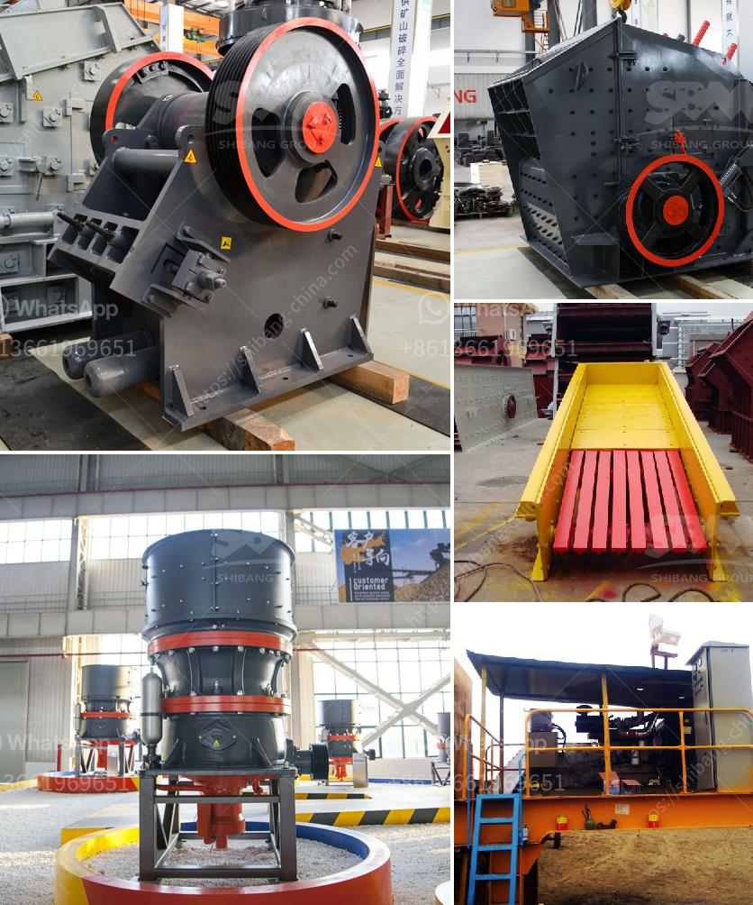

<h3>coal powder mill</h3>
Coal is one of the most widely used sources of energy in many industries across the globe. Its abundance, affordability, and versatility make it a preferred choice for power generation and industrial processes. To harness the full potential of coal, it needs to be pulverized into fine particles, which is where a coal powder mill comes into play.

A coal powder mill is a specialized machine that grinds coal into pulverized powder. It is designed to enhance the combustion efficiency and heat release of coal, enabling it to efficiently ignite and burn. This vital tool plays a crucial role in various industries, including power generation plants, cement production, steel mills, and many others.

One of the primary advantages of using a coal powder mill is the enhanced combustion efficiency it offers. By grinding coal into fine powder, the surface area of the coal particles increases significantly. This increased surface area allows for better mixing of the coal with air, leading to improved combustion. As a result, more energy is released, and less coal is wasted, leading to higher overall efficiency in energy production.

In addition to improved combustion efficiency, a coal powder mill also helps achieve cleaner overall combustion. When coal is pulverized into fine powder, it burns more completely, with fewer emissions of unburned carbon particles, sulfur oxides, and nitrogen oxides. This is important from an environmental standpoint, as it helps reduce air pollution and comply with increasingly stringent emission regulations.

Furthermore, a coal powder mill provides better control over the combustion process. By finely grinding coal, the particle size distribution can be more closely controlled. This allows for precise adjustments of the coal-air mixture ratio, which is essential for maintaining stable and optimal combustion conditions. The ability to finely control the coal particle size also enables better flame stability, reducing the risk of flameouts or other operational issues.

The modern coal powder mill is equipped with advanced technologies to ensure efficient and safe operation. These include high-efficiency classifiers, advanced control systems, and precision grinding equipment. The high-efficiency classifiers improve the classification of coal particles, ensuring that the desired particle size distribution is achieved. Advanced control systems allow for precise adjustment of process parameters, optimizing the operation of the coal powder mill. Precision grinding equipment ensures consistent and uniform grinding of coal, further enhancing the overall efficiency of the mill.

In conclusion, a coal powder mill is a vital tool for effective and efficient combustion of coal. By grinding coal into fine powder, it enhances combustion efficiency, achieves cleaner overall combustion, and provides better control over the combustion process. With innovative technologies and advanced equipment, the modern coal powder mill plays a crucial role in various industries, enabling them to harness the full potential of coal as a reliable and affordable source of energy.
<h3>Contact us</h3><ul><li><strong>Whatsapp:&nbsp;<a href="https://wa.me/8613661969651">+8613661969651</a></strong></li><li><a href="https://swt.shibang-china.com/?git&amp;zhl&amp;coal powder mill"><strong>Online Service(chat now)</strong></a></li></ul><h3>Related</h3><ul><li><a href='stone crusher machine for sale in kenya.md'>stone crusher machine for sale in kenya</a></li><li><a href='mobile gold processing plant for sale in south africa.md'>mobile gold processing plant for sale in south africa</a></li><li><a href='mini stone jaw crushers.md'>mini stone jaw crushers</a></li><li><a href='machine of ultra fine mills.md'>machine of ultra fine mills</a></li><li><a href='gold ore hammer mills that are diesel driven.md'>gold ore hammer mills that are diesel driven</a></li></ul>