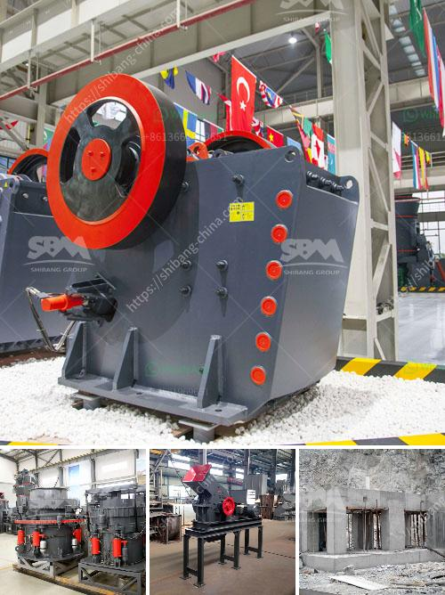

<h3>coal preparation plant cost</h3>
Coal preparation plants, also known as coal handling and preparation plants (CHPP), are facilities that wash coal of soil and rock, crush it into graded-sized chunks, and stockpile grades. They prepare coal in terms of size, quality, and consistency for various purposes, such as power generation and industrial uses.

Coal preparation plant cost varies based on several factors, including the size of the plant, the process used, the level of automation, and the specific requirements of the end-user. In general, the cost of a coal preparation plant ranges from $1,000 to $10,000 per ton of annual throughput capacity, excluding land and site development costs.

One of the main determinants of coal preparation plant cost is its size. Larger plants require more extensive engineering, equipment, and infrastructure, resulting in higher capital costs. The annual throughput capacity, i.e., the volume of coal processed per year, also affects the cost. Higher throughput capacity requires larger equipment and more raw materials, thus increasing the overall cost.

The technology and process employed in the coal preparation plant also impact its cost. Different techniques, such as dense medium separation, cyclones, froth flotation, and gravity separation, have varying costs associated with equipment, reagents, and energy consumption. The selection of the appropriate technology should consider the specific coal characteristics and the desired quality of the final product.

Automation plays a crucial role in reducing coal preparation plant costs by eliminating manual labor and improving efficiency. Automated systems can control and monitor various processes, including coal washing, crushing, screening, and sorting. Although automation brings initial investments, it significantly reduces operational costs in the long run through increased productivity and reduced downtime. Additionally, automation enhances safety and reduces the risk of accidents, further reducing costs associated with workplace incidents and injuries.

The environmental regulations and standards to which the coal preparation plant must adhere also affect its cost. Compliance with emissions control, wastewater management, and land reclamation requirements adds capital and operational costs. Implementing measures to minimize environmental impact, such as installing advanced pollution control technologies and waste recycling systems, can increase the overall cost of the plant.

In addition to the aforementioned factors, other costs to consider include labor, maintenance, and utility expenses like electricity and water. Operational costs should be accurately estimated to assess the economic viability of the coal preparation plant.

Despite the upfront costs, investing in a coal preparation plant brings several benefits. It improves the efficiency of coal utilization, reduces emissions and environmental impacts, and ensures a higher quality product suitable for various applications. Furthermore, having a preparation plant on-site allows for greater control and flexibility over the coal supply, reducing dependence on external suppliers and potential price fluctuations.

In conclusion, the cost of a coal preparation plant depends on various factors, such as size, technology, automation, and compliance requirements. While upfront capital costs may be significant, the long-term benefits and operational efficiency make it a worthwhile investment. Proper planning, accurate cost estimation, and careful consideration of the specific needs of end-users are crucial for determining the most appropriate and cost-effective coal preparation plant solution.
<h3>Contact us</h3><ul><li><strong>Whatsapp:&nbsp;<a href="https://wa.me/8613661969651">+8613661969651</a></strong></li><li><a href="https://swt.shibang-china.com/?git&amp;zhl&amp;coal preparation plant cost"><strong>Online Service(chat now)</strong></a></li></ul><h3>Related</h3><ul><li><a href='quartz ball mill manufacturer hyderabad.md'>quartz ball mill manufacturer hyderabad</a></li><li><a href='ballast stone crusher in india.md'>ballast stone crusher in india</a></li><li><a href='granite impact crusher.md'>granite impact crusher</a></li><li><a href='ball mill plant manufacturers.md'>ball mill plant manufacturers</a></li><li><a href='crusher plant for sale in south africa.md'>crusher plant for sale in south africa</a></li></ul>