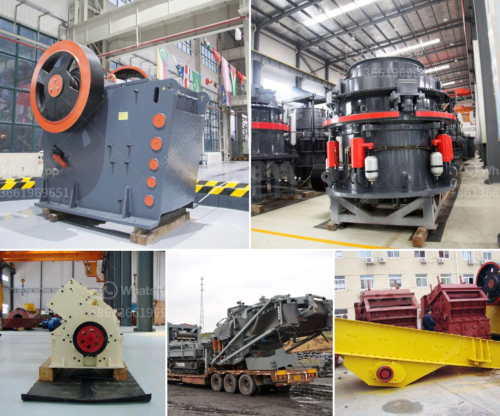

<h3>coal processing plants south africa</h3>
Coal is a vital resource in South Africa, as it fuels the country's energy sector, which is essential for industrial and economic growth. While the importance of coal cannot be disputed, it is equally important to understand the environmental and health impacts that come with coal processing plants. In this article, we delve into the topic of coal processing plants and how they contribute to the well-being of South Africa.

Coal processing plants are located in close proximity to the coal mines to facilitate the transportation of raw coal from the mining location to the processing plant. Utilizing conveyor belts, the coal is transferred to a series of crushers, which break it down into various sizes. The crushed coal is then sorted and separated into different grades based on its quality and intended use.

One of the critical processes in a coal processing plant is the washing of the coal. This process removes impurities and minerals, resulting in cleaner and more efficient coal. The slurry, a mixture of water and fine coal particles, is treated with chemicals to separate the coal from impurities. The cleaned coal can then be used for various purposes, including power generation, steel production, and cement manufacturing.

Coal processing plants in South Africa contribute significantly to the economy and employment in the region. In addition to generating electricity through coal-fired power stations, they also produce coal for export and domestic use. The export market for South African coal is booming, with countries like India and China relying heavily on South Africa for their energy needs.

Despite the economic benefits, coal processing plants come with their fair share of environmental concerns. South Africa is already grappling with the challenges of air and water pollution, and coal processing plants further contribute to these issues. Burning coal for energy is a significant source of greenhouse gas emissions, contributing to climate change and global warming. Additionally, the extraction process and disposal of coal waste can lead to soil and water contamination, further endangering biodiversity in the region.

Furthermore, coal processing plants pose health risks to nearby communities. The dust and emissions from coal processing plants contain harmful pollutants, including sulfur dioxide, nitrogen oxides, and fine particulate matter, which can lead to respiratory problems, cardiovascular diseases, and even premature death. Additionally, the release of mercury during the burning process can contaminate water bodies, causing mercury poisoning in aquatic life and those who consume it.

To address these concerns, South Africa has implemented a range of environmental regulations and emission standards for coal processing plants. These regulations aim to reduce the environmental and health impacts of coal processing, emphasizing the need for cleaner technologies and stricter monitoring of emissions. Research and development in cleaner coal technologies, such as carbon capture and storage, are also being pursued to mitigate the adverse environmental effects of coal processing.

In conclusion, coal processing plants in South Africa play a vital role in the country's energy sector, contributing to economic growth and employment. However, it is crucial to acknowledge and address the environmental and health impacts associated with these plants. Stricter regulations, improved technologies, and a greater emphasis on renewable energy sources are necessary to ensure a more sustainable future for South Africa's energy sector.
<h3>Contact us</h3><ul><li><strong>Whatsapp:&nbsp;<a href="https://wa.me/8613661969651">+8613661969651</a></strong></li><li><a href="https://swt.shibang-china.com/?git&amp;zhl&amp;coal processing plants south africa"><strong>Online Service(chat now)</strong></a></li></ul><h3>Related</h3><ul><li><a href='iron ore beneficiation plant cost.md'>iron ore beneficiation plant cost</a></li><li><a href='iron ore processing machine cost.md'>iron ore processing machine cost</a></li><li><a href='secondary rock crusher for sale in south africa.md'>secondary rock crusher for sale in south africa</a></li><li><a href='stone crusher plant machinery.md'>stone crusher plant machinery</a></li><li><a href='jaw crusher price in china.md'>jaw crusher price in china</a></li></ul>