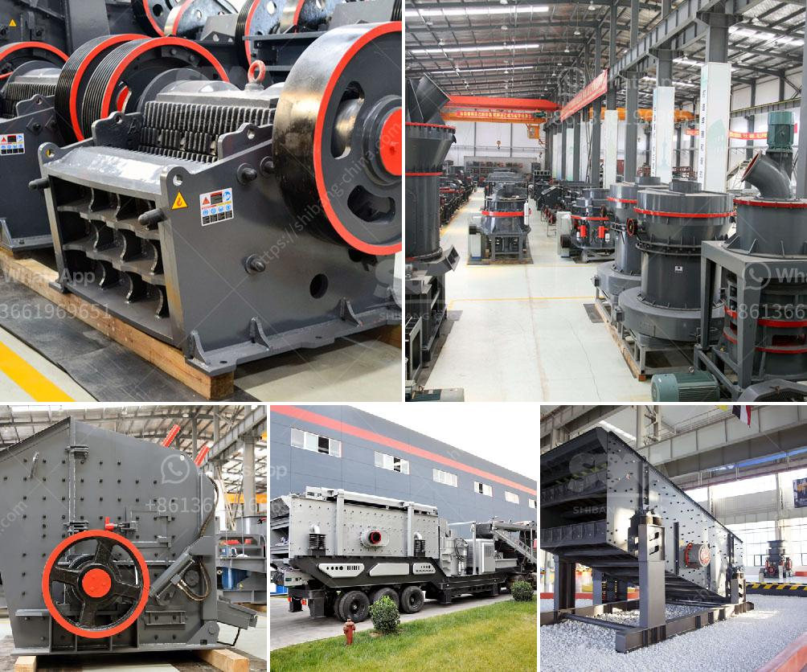

<h3>coal screening machine for sale in india</h3>
Coal Screening machine for sale in India: Providing Efficiency and Cost-Effectiveness to the Coal Industry

Coal is one of the most reliable sources of energy in India and plays a crucial role in powering the country's economy. However, the process of mining coal can be hazardous and environmentally damaging. To ensure the efficiency and safety of coal mining operations, a robust screening machine is indispensable. In India, the demand for coal screening machines has been steadily increasing as companies aim to enhance productivity and reduce environmental impact. This article explores the significance of coal screening machines for sale in India and how they contribute to the coal industry's progress.

Coal screening machines are designed to efficiently separate the coal particles based on size, shape, and density. They help in maximizing coal recovery and minimizing waste by ensuring that only the desired coal particles are sent for further processing. By accurately segregating coal particles, these machines enable coal companies to achieve higher extraction rates, enhance product quality, and reduce operational costs.

In India, where coal is abundantly available, the need for effective screening machines is paramount. The country heavily relies on coal for electricity generation, industrial processes, and cooking fuel. Thus, utilizing advanced screening machines allows the coal industry to meet the growing demand while minimizing the negative environmental impacts associated with coal mining. These machines ensure that the coal produced is of high quality, thus reducing emissions and improving the overall efficiency of coal-fired power plants.

The advent of modern coal screening machines has revolutionized the coal mining industry in India. Traditional methods of coal screening involved manual sorting, which was time-consuming, labor-intensive, and prone to human error. With the introduction of automated screening machines, these challenges have been overcome, leading to increased productivity and operational efficiency.

One of the leading companies providing coal screening machines for sale in India is Multotec. Their range of screening solutions caters to various requirements of the coal industry. Multotec's machines are equipped with advanced technology, such as vibrating screens and centrifuges, which ensure accurate particle separation and efficient coal recovery. These machines are designed to withstand the harsh conditions of coal mining sites and deliver reliable performance even in the most demanding situations.

The benefits of using coal screening machines extend beyond improved productivity and cost-effectiveness. By minimizing the amount of waste generated during the screening process, these machines reduce the environmental impact of coal mining. Additionally, they enhance worker safety by automating the sorting process, eliminating the need for manual handling of coal particles.

With the increasing demand for coal screening machines in India, the market is becoming competitive. Manufacturers are constantly innovating and developing advanced technologies to provide efficient and reliable screening solutions. This competition benefits the industry as companies strive to offer the best solutions at reasonable prices, making coal screening machines more accessible to small and medium-sized coal mining companies.

In conclusion, the availability of coal screening machines for sale in India has proven to be a game-changer for the coal industry. These machines not only contribute to the efficiency and cost-effectiveness of coal mining operations but also reduce environmental impact and improve worker safety. As the demand for coal continues to rise in India, the importance of advanced screening machines cannot be overstated. By investing in state-of-the-art screening technology, coal companies can meet the country's energy needs sustainably and propel the coal industry's growth.
<h3>Contact us</h3><ul><li><strong>Whatsapp:&nbsp;<a href="https://wa.me/8613661969651">+8613661969651</a></strong></li><li><a href="https://swt.shibang-china.com/?git&amp;zhl&amp;coal screening machine for sale in india"><strong>Online Service(chat now)</strong></a></li></ul><h3>Related</h3><ul><li><a href='lime stone crusher manufacture in india.md'>lime stone crusher manufacture in india</a></li><li><a href='dolomite crusher equipment.md'>dolomite crusher equipment</a></li><li><a href='stationary crusher plant.md'>stationary crusher plant</a></li><li><a href='twist of the ball mill.md'>twist of the ball mill</a></li><li><a href='quarrying crusher machines south africa.md'>quarrying crusher machines south africa</a></li></ul>