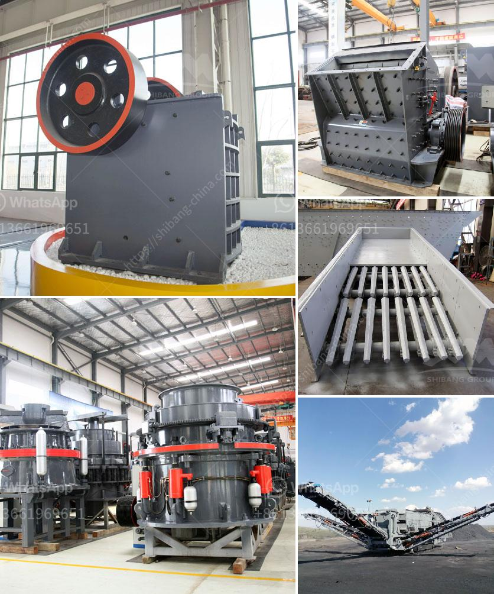

<h3>coal size used for mills</h3>
When it comes to coal mills, finding the right particle size distribution is crucial for ensuring the most efficient combustion process. The size of the coal used in the mill affects both the performance of the mill and the overall efficiency of the power plant. In this article, we will delve into the importance of coal size and explore the optimal range of particle sizes that should be used for mills.

Coal mills are used to pulverize and dry coal before it is blown into the combustion chamber of a boiler in a coal-fired power plant. The coal is fed into the mill through a central inlet pipe where it is crushed by the grinding wheels rotating at high speed. The pulverized coal is then conveyed to the combustion chamber through the discharge pipe.

The particle size of the coal plays a significant role in the combustion process. If the coal particles are too large, they will not burn efficiently, resulting in lower heat output. On the other hand, if the particles are too small, they may burn too quickly, leading to unstable combustion, higher emissions, and reduced overall efficiency.

To achieve optimal combustion efficiency, coal mills are designed to handle a wide range of coal sizes. Typically, mills are capable of grinding coal particles with sizes ranging from about 50 to 200 microns. However, most modern power plants require coal sizes within the narrower range of 75 to 150 microns.

The reason for this narrow range is twofold. Firstly, smaller coal particles have a higher surface area to volume ratio, allowing for faster combustion reactions. This leads to improved combustion efficiency and a more stable flame. Secondly, particles within the specified range ensure proper coal distribution within the combustion chamber, preventing localized hotspots and reducing the likelihood of slagging and fouling on heat transfer surfaces.

To achieve the desired coal size, mills are equipped with grinding elements such as grinding balls or grinding rings. These elements crush the coal particles between them as they rotate, reducing the size further. Different mills employ different mechanisms for size reduction, including impact, attrition, and crushing.

It is important to note that coal mills are not capable of producing uniform coal particles. Rather, they generate a wide distribution of particle sizes. However, by carefully controlling the mill operation parameters and using appropriate grinding elements, it is possible to achieve a particle size distribution that falls within the desired range.

To optimize the coal size for mills and maximize combustion efficiency, power plant operators often conduct coal analysis tests. These tests determine the coal's inherent moisture content, volatile matter content, ash content, and calorific value. Based on this information, operators can adjust the mill parameters to produce the desired particle size distribution. They can also make necessary adjustments to the combustion process to accommodate variations in coal quality.

In conclusion, the size of coal used in mills significantly impacts mill performance and the overall efficiency of a power plant. Maintaining the appropriate particle size distribution helps ensure efficient combustion and prevents issues such as slagging and fouling. By carefully controlling mill operation parameters and conducting regular coal analysis, power plant operators can optimize coal size for mills, improving overall plant performance and reducing environmental impact.
<h3>Contact us</h3><ul><li><strong>Whatsapp:&nbsp;<a href="https://wa.me/8613661969651">+8613661969651</a></strong></li><li><a href="https://swt.shibang-china.com/?git&amp;zhl&amp;coal size used for mills"><strong>Online Service(chat now)</strong></a></li></ul><h3>Related</h3><ul><li><a href='fly ash grinding machine manufacturar in india.md'>fly ash grinding machine manufacturar in india</a></li><li><a href='grinding steel balls for mining.md'>grinding steel balls for mining</a></li><li><a href='iron slag crushing ball mill in nagpur.md'>iron slag crushing ball mill in nagpur</a></li><li><a href='ball mills for mining in china.md'>ball mills for mining in china</a></li><li><a href='aggregate washing plant manufacturers usa.md'>aggregate washing plant manufacturers usa</a></li></ul>