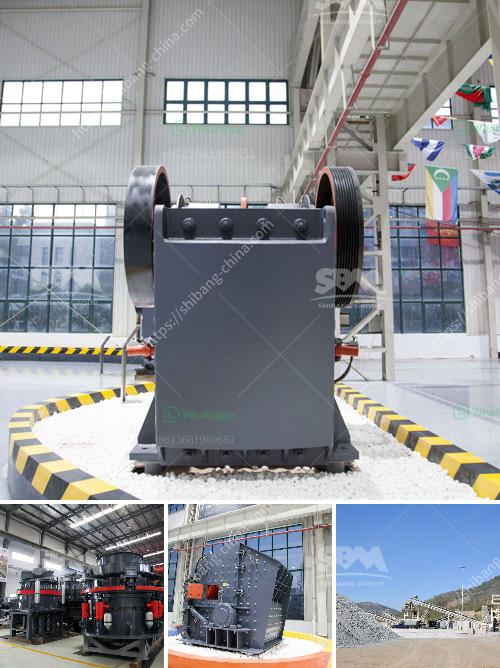

<h3>coal vibrating screen manufacturers in south africa</h3>
Coal mining in South Africa is one of the country's largest industries, contributing significantly to its economy. Tremendous strides have been made in improving coal mining operations in South Africa, with several world-class manufacturers of coal vibrating screens contributing immensely to the mining industry's growth.

Coal vibrating screens are used to separate materials into various sizes for further processing. These screens are used in the mining industry to separate coal by size and create a finished product that can be used as fuel. The manufacturing of vibrating screens in South Africa has played a significant role in the country's coal mining industry.

Coal vibrating screen manufacturers have developed various types of modern and efficient vibrating screens, including circular vibrating screens, linear vibrating screens, and high-frequency vibrating screens. These screens have a wide range of applications in coal processing plants and can handle materials ranging from fine coal to heavy-duty coarse coal.

One of the leading coal vibrating screen manufacturers in South Africa is Kwatani. Kwatani's vibrating screens have been used in the coal industry for over 40 years and are known for their high-quality construction and long-lasting performance. Kwatani also customizes their vibrating screens to meet specific customer requirements, ensuring optimal performance and efficiency.

Another reputable player in the South African coal vibrating screen market is Vibramech. Vibramech manufactures a wide range of vibrating screens for the coal industry, utilizing their extensive experience and expertise. Their screens are known for their robust construction, reliability, and low maintenance requirements. Vibramech's vibrating screens are custom-designed to meet each customer's specific requirements, ensuring superior performance and efficiency.

Multotec is another established manufacturer of vibrating screens for the coal industry in South Africa. Multotec's screens are renowned for their high-quality construction and excellent performance. They offer a range of tailored solutions for various coal processing applications, including primary, secondary, and tertiary screening. Multotec's vibrating screens are durable, reliable, and designed to maximize coal processing efficiency.

In conclusion, South Africa's coal mining industry relies heavily on the use of vibrating screens to separate coal into different sizes for further processing. Several reputable manufacturers, including Kwatani, Vibramech, and Multotec, have contributed significantly to the country's coal mining industry through the production of reliable and efficient coal vibrating screens. The continuous advancements in vibrating screen technology have improved coal mining operations in South Africa, making it one of the world's leading coal producers.
<h3>Contact us</h3><ul><li><strong>Whatsapp:&nbsp;<a href="https://wa.me/8613661969651">+8613661969651</a></strong></li><li><a href="https://swt.shibang-china.com/?git&amp;zhl&amp;coal vibrating screen manufacturers in south africa"><strong>Online Service(chat now)</strong></a></li></ul><h3>Related</h3><ul><li><a href='micron limestone grinding unit in india.md'>micron limestone grinding unit in india</a></li><li><a href='crusher for crushing calcium carbonate.md'>crusher for crushing calcium carbonate</a></li><li><a href='quick lime hammer crusher.md'>quick lime hammer crusher</a></li><li><a href='malaysia crusher plant manufacturer and supplier.md'>malaysia crusher plant manufacturer and supplier</a></li><li><a href='vibrating screen manufacturers.md'>vibrating screen manufacturers</a></li></ul>