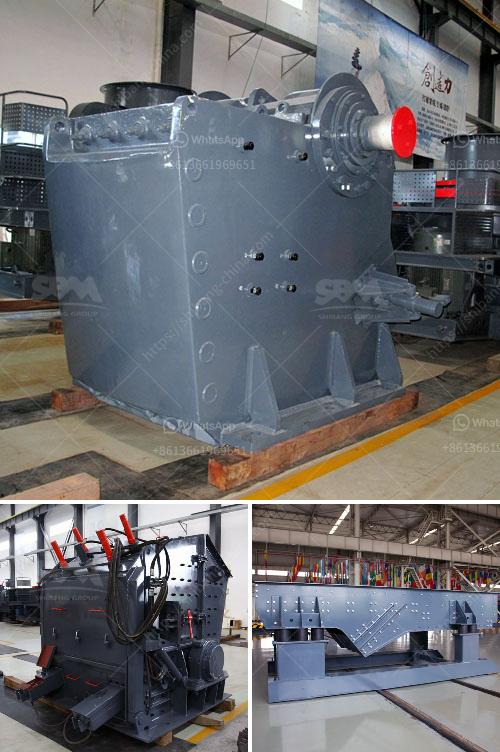

<h3>coal washing plant for sale in south africa</h3>
Coal washing plant for sale in South Africa is a highly competitive market with a wide variety of options to choose from. South Africa has a vast mineral resource base and is a leading producer and exporter of coal products.

Coal washing removes impurities in the coal, thereby improving its quality. One such impurity is ash, which affects the coal's combustion efficiency. Coal washing plants also help in reducing the release of harmful gases like sulfur dioxide, which is responsible for acid rain.

South Africa is the 10th largest coal producer in the world, with coal reserves estimated at around 30 billion tons. The country's coal production reached 251.6 million tons in 2020, making it the third-largest global coal exporter.

The demand for coal is expected to remain strong in South Africa and globally, driven by the growing energy needs of developing economies. As a result, the demand for coal washing plants in South Africa has seen a steady increase.

There are several benefits associated with coal washing plants. Firstly, they enhance the quality of coal, making it more suitable for various applications, including power generation and industrial processes. This, in turn, leads to improved efficiency and reduced emissions.

Secondly, coal washing plants help in reducing the environmental impact of coal mining. By removing impurities like ash, the plants decrease the amount of waste material that needs to be stored in coal mining areas, thereby minimizing the risk of contamination of soil and water bodies.

Thirdly, coal washing plants create employment opportunities in the mining sector. They require skilled labor, technicians, and engineers to operate and maintain the plants, providing job opportunities for local communities.

If you are interested in purchasing a coal washing plant in South Africa, there are several factors to consider. Firstly, you need to assess your specific requirements, such as the capacity of the plant, the level of technology, and the type of coal you want to process.

Secondly, it is important to conduct thorough research and due diligence before making a purchase. Look for reputable suppliers with a proven track record in the industry and consider factors like after-sales service, spare parts availability, and customer support.

Furthermore, consider factors like the cost of the plant, financing options available, and the timeline for delivery and installation. It is also advisable to consult with experts in the sector who can provide guidance and assistance throughout the buying process.

In conclusion, the coal washing plant market in South Africa offers a wide range of options for buyers. With the increasing demand for coal and the need for clean coal technologies, investing in a coal washing plant can be a profitable venture. However, it is important to conduct thorough research and due diligence before making a purchase to ensure that you choose the right plant that meets your specific needs.
<h3>Contact us</h3><ul><li><strong>Whatsapp:&nbsp;<a href="https://wa.me/8613661969651">+8613661969651</a></strong></li><li><a href="https://swt.shibang-china.com/?git&amp;zhl&amp;coal washing plant for sale in south africa"><strong>Online Service(chat now)</strong></a></li></ul><h3>Related</h3><ul><li><a href='grinding mill machine in sri lanka.md'>grinding mill machine in sri lanka</a></li><li><a href='estimated cost of building a steel mill.md'>estimated cost of building a steel mill</a></li><li><a href='price of concrete crushing machine for sale.md'>price of concrete crushing machine for sale</a></li><li><a href='horizontal grinding mills price.md'>horizontal grinding mills price</a></li><li><a href='iron ore beneficiation process price.md'>iron ore beneficiation process price</a></li></ul>