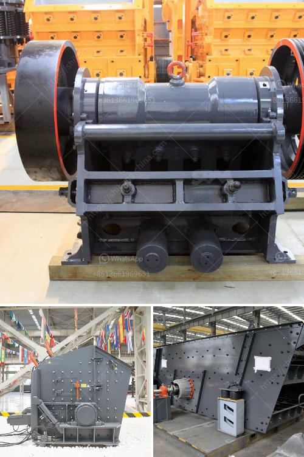

<h3>coal washing plant for sale</h3>
Coal washing plant for sale is an effective and efficient method to clean and process coal for higher quality end products. In the coal washing process, a dense medium separation (DMS) plant is used to separate the coal particles from rock and other debris based on their specific gravity differences. As the coal is fed into the plant, it is crushed, screened, and washed to remove impurities and create a clean and marketable product.

There are several key benefits of coal washing plants. Firstly, it improves the quality of coal by reducing ash and sulfur content, which enhances its combustion efficiency and reduces environmental pollution. Clean coal also has a higher heating value, making it more cost-effective for energy production. Additionally, by removing impurities, coal washing reduces wear and tear on equipment, prolonging their lifespan and reducing maintenance costs.

A coal washing plant for sale provides a turnkey solution for coal processing operations. The plant comes equipped with all the required equipment, including crushers, screens, feeders, cyclones, coal spirals, magnetic separators, pumps, and dense medium vessels. These components work together to effectively and efficiently process coal, ensuring maximum recovery of coal particles and minimum loss of valuable resources.

Furthermore, a coal washing plant for sale can be customized to meet specific requirements and conditions. The plant can be designed to accommodate different coal types and sizes, as well as variations in feed rates and product specifications. This adaptability allows operators to achieve the desired results and effectively manage coal quality.

Investing in a coal washing plant for sale is a smart decision for coal processing companies. It not only improves the marketability and value of their coal products but also helps meet environmental regulations. By adopting clean coal technologies such as coal washing, the industry can contribute to sustainable and responsible energy production.

In conclusion, a coal washing plant for sale offers numerous benefits to coal processing operations. It improves coal quality, reduces impurities, and enhances combustion efficiency, while reducing equipment wear and environmental pollution. The turnkey nature of these plants ensures efficient and effective coal processing, making them a valuable investment for coal companies seeking to optimize their operations.
<h3>Contact us</h3><ul><li><strong>Whatsapp:&nbsp;<a href="https://wa.me/8613661969651">+8613661969651</a></strong></li><li><a href="https://swt.shibang-china.com/?git&amp;zhl&amp;coal washing plant for sale"><strong>Online Service(chat now)</strong></a></li></ul><h3>Related</h3><ul><li><a href='gravel crusher equipment.md'>gravel crusher equipment</a></li><li><a href='sand washers machine.md'>sand washers machine</a></li><li><a href='300tpd cement plant cost in india.md'>300tpd cement plant cost in india</a></li><li><a href='feasibility report for black stone crushers in jharkhand.md'>feasibility report for black stone crushers in jharkhand</a></li><li><a href='process of talcum powder mill.md'>process of talcum powder mill</a></li></ul>