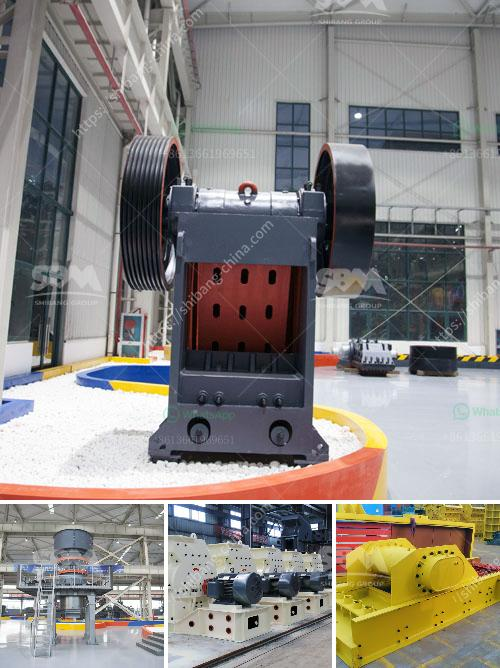

<h3>coal washing plant suppliers</h3>
Coal washing is a process that is undertaken in a coal washery or coal preparation plant (CPP) where coal is refined to remove impurities, producing higher-quality coal for power generation or metallurgical applications. There are several coal washing plant suppliers in the market who offer different types of coal washing equipment.

One popular supplier is Dense Media Cyclone (DMC) plants, which are widely used for washing and separating coal particles based on their density differences. These plants utilize a cyclone separator, which uses centrifugal force and gravity to separate coal from waste material, such as stones and minerals. The clean coal is then dewatered and dried before being transported.

Another reliable supplier is the Spiral Coal Washing Plant, which utilizes the principle of gravity separation to separate fine coal from other impurities. In this process, coal is fed into a spiral chute where gravity causes the heavier impurities to settle to the bottom, while lighter coal particles are carried to the top and collected in a separate vessel. This plant is known for its efficiency in removing impurities and producing clean coal.

Moreover, Modular Coal Washing Plants are gaining popularity in the market due to their flexibility and ease of installation. These plants are designed in modules, allowing for easy expansion or relocation as per the requirements of the coal mine. They incorporate various washing techniques, such as jigging, cyclones, and gravity separation, to achieve high-quality coal output.

When selecting a coal washing plant supplier, it is crucial to consider factors such as their experience, reputation, and after-sales service. Additionally, the supplier should be able to provide customized solutions to meet specific coal quality and quantity requirements. Regular maintenance and optimization of the plant are also important to ensure its long-term performance and efficiency.

To conclude, several coal washing plant suppliers offer a range of equipment and technologies to produce clean coal for various applications. The choice of supplier depends on factors such as the specific requirements of the coal mine, budget, and long-term operational efficiency. Investing in efficient coal washing plants contributes to the sustainable and responsible use of coal as an energy source.
<h3>Contact us</h3><ul><li><strong>Whatsapp:&nbsp;<a href="https://wa.me/8613661969651">+8613661969651</a></strong></li><li><a href="https://swt.shibang-china.com/?git&amp;zhl&amp;coal washing plant suppliers"><strong>Online Service(chat now)</strong></a></li></ul><h3>Related</h3><ul><li><a href='gypsum powder processing plant cost.md'>gypsum powder processing plant cost</a></li><li><a href='cost on vsi crusher.md'>cost on vsi crusher</a></li><li><a href='kaolin processing plant machinery.md'>kaolin processing plant machinery</a></li><li><a href='crusher in china.md'>crusher in china</a></li><li><a href='gold ore crusher machine.md'>gold ore crusher machine</a></li></ul>