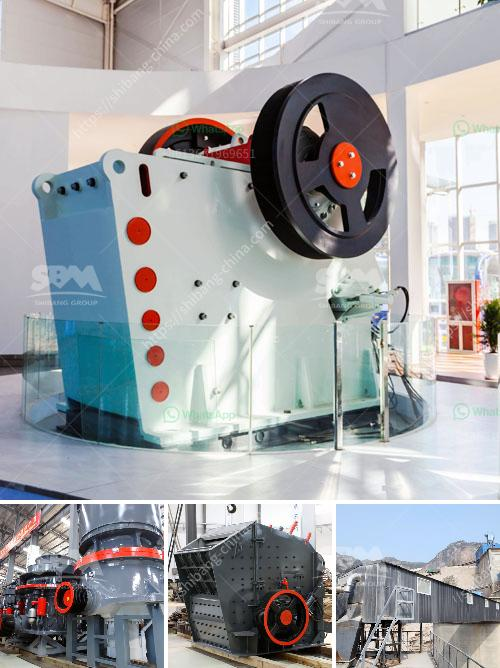

<h3>cobalt mobile crushing plant</h3>
The demand for Cobalt, a key component in the batteries of electric vehicles, is set to skyrocket in the coming years. With the rapid growth in the electric vehicle market, the need for cobalt to manufacture batteries will only increase. However, mining and processing of cobalt ores are associated with numerous environmental, economic, and social challenges. As a result, it is essential to find alternatives to traditional mining methods that are both sustainable and cost-effective.

One compelling solution is mobile crushing plants, as they are often more cost-effective and efficient. Mobile crushing plants are becoming increasingly popular in the mining industry due to their efficiency, versatility, and ease of use. With their ability to produce precisely shaped, cubical end products, mobile impact crushers are becoming increasingly important in the production of high-quality aggregates. Moreover, they offer the additional benefit of producing a consistent end product regardless of the feed material, making them highly adaptable.

A mobile crushing plant is a unique machine that includes three stages of crushing. It has been around for many years, but the mobile crushing plant is finally reaching its peak. The main characteristics of the mobile crushing plant are: little space required, improved production capacity, environment protection, and of course, great mobility. Currently, it is the most advanced crushing equipment available on the market.

The mobile crushing plant is ideal for demanding primary crushing of hard rocks and recycled materials. They also provide excellent cubicity capabilities and are effective in open-pit mining. It significantly reduces the production time. The mobile impact crushing plants are used for soft to medium-hard natural stone and for the reprocessing of residual construction materials.

The recycling of materials generated in the construction of new infrastructure, buildings, and residential communities, as well as materials generated in the demolition process, is a rapidly-growing industry that preserves both landfill space and finite resources. The mobile crushing plant can recycle concrete, brick, asphalt, or stone waste from demolitions, construction of a building, or roadways by turning waste material into top quality crushed material for use on a construction site or to fill voids in existing concrete.

The mobile crusher plants are easy to transport and install. After the completion of the short-term work, it can be carried by a single truck head to other worksites and installation of the plant can be done on the same day. Firms choose between these facilities depending on their working time. All these facilities can be produced with different capacities and different crushers.

With such advantages, the mobile crushing plant is widely used in the mining industry and construction waste recycling industry for its outstanding features as follows:

1. Mobility: The mobile crushing plant is easy to transport and install, which enhances flexibility, especially in terms of crushing construction waste. It has excellent maneuverability, which makes it a reliable choice for both short-term and long-term projects.

2. Versatility: The mobile crushing plant can work independently or jointly according to the coarse crushing or the finely crushing required products. It can also be combined into other plants to achieve different production requirements.

3. Reliability: The mobile crushing plant is a flexible and powerful crushing solution designed for small to medium projects. It provides on-sites crushing without material transporting from one place to another, thus reducing your material transportation costs. The output capacity ranges from 100t/h to 400t/h.

To sum up, the mobile crushing plant is a reliable and efficient type of crushing equipment, which is indispensable in the global cobalt mining industry. The compact structure reduces the area occupied, and is especially suitable for the small crushing site. The modularized and automated operation design of the mobile crusher reduces labor costs. The intelligent PLC automatic monitoring system can predict the failure of machine equipment, effectively avoiding the occurrence of major accidents. Therefore, the cobalt mobile crushing plant is a win-win choice for investing in cobalt ore mining.
<h3>Contact us</h3><ul><li><strong>Whatsapp:&nbsp;<a href="https://wa.me/8613661969651">+8613661969651</a></strong></li><li><a href="https://swt.shibang-china.com/?git&amp;zhl&amp;cobalt mobile crushing plant"><strong>Online Service(chat now)</strong></a></li></ul><h3>Related</h3><ul><li><a href='crusher material for stone.md'>crusher material for stone</a></li><li><a href='mobile coal screen units south africa.md'>mobile coal screen units south africa</a></li><li><a href='silica sand machinery manufacturer from india.md'>silica sand machinery manufacturer from india</a></li><li><a href='crushing production line manufacturer.md'>crushing production line manufacturer</a></li><li><a href='marble powder making machine in production.md'>marble powder making machine in production</a></li></ul>