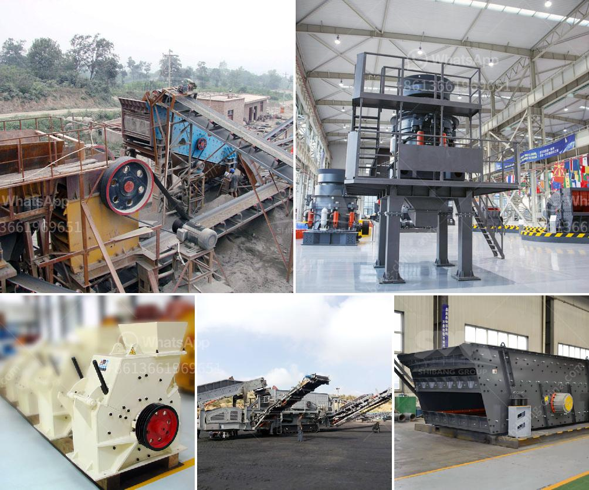

<h3>cocoa processing plant in india</h3>
India is known for its diverse agricultural produce, and one of its notable exports is cocoa. Cocoa processing plants in India have played a significant role in establishing the country as a major player in the global cocoa industry.

Cocoa processing plants are facilities that convert cocoa beans into various forms, such as cocoa powder, cocoa butter, and cocoa liquor. These plants are equipped with specialized machinery and follow strict quality regulations to ensure the production of premium cocoa products.

India's cocoa processing plants have witnessed tremendous growth in recent years, owing to the increasing demand for cocoa-based products in the domestic and international markets. The country's favorable climate, particularly in states like Kerala, Tamil Nadu, and Karnataka, has made it conducive to cocoa cultivation.

One of the prominent cocoa processing plants in India is located in the state of Karnataka. This facility employs advanced technology to process cocoa beans and extract various derivatives. The plant strictly adheres to international quality standards and prioritizes sustainability in its operations.

The benefits of having cocoa processing plants in India are manifold. Firstly, it provides employment opportunities for local communities, thereby contributing to the socioeconomic development of the regions surrounding these plants. Additionally, these plants function as hubs for cocoa farmers, allowing them to sell their produce at fair prices and sustain their livelihoods.

Furthermore, the presence of cocoa processing plants boosts the national economy through export revenues. Indian cocoa and its derivatives are exported to several countries, including the United States, Germany, the Netherlands, and Japan. This contributes to India's foreign exchange earnings and enhances its global trade relations.

To ensure the continued growth and success of cocoa processing plants in India, it is crucial to invest in research and development. This will facilitate innovation, improve product quality, and lead to the creation of value-added cocoa products that cater to the changing preferences of consumers.

In conclusion, cocoa processing plants in India have emerged as integral players in the global cocoa industry. With their advanced facilities, adherence to quality standards, and focus on sustainability, these plants contribute significantly to the local economy while paving the way for India to establish itself as a leading cocoa processing nation.
<h3>Contact us</h3><ul><li><strong>Whatsapp:&nbsp;<a href="https://wa.me/8613661969651">+8613661969651</a></strong></li><li><a href="https://swt.shibang-china.com/?git&amp;zhl&amp;cocoa processing plant in india"><strong>Online Service(chat now)</strong></a></li></ul><h3>Related</h3><ul><li><a href='bauxite plant in dubai.md'>bauxite plant in dubai</a></li><li><a href='portable limestone crushing systems.md'>portable limestone crushing systems</a></li><li><a href='cone crushers supplier mining.md'>cone crushers supplier mining</a></li><li><a href='rock crusher in kenya.md'>rock crusher in kenya</a></li><li><a href='rock drills for sale in south africa.md'>rock drills for sale in south africa</a></li></ul>