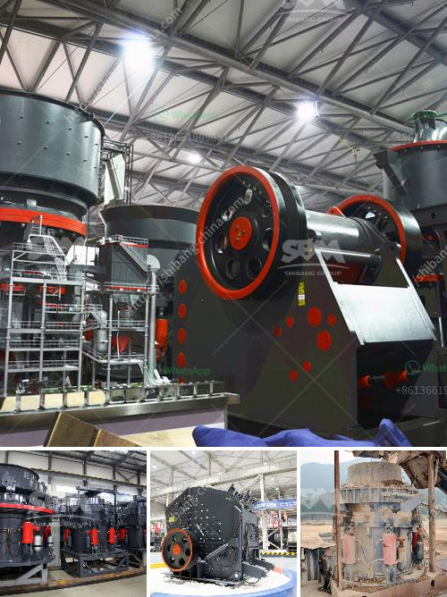

<h3>companies selling mining equipment in dubai</h3>
Dubai, known for its vast desert landscape, has been a growing hub for global trade and commerce. It has become a hotspot for businesses in various sectors, including mining. As the demand for natural resources continues to rise, companies in Dubai are capitalizing on the opportunity by selling mining equipment to both local and international clients.

In recent years, the mining industry has experienced substantial growth. The need for minerals, metals, and other resources has surged due to the global population increase and the rapid development of infrastructure projects. As a result, companies in Dubai have recognized the potential in supplying mining equipment to satisfy this escalating demand.

One major advantage for companies operating in Dubai is the strategic location of the city itself. Situated at the crossroads of Europe, Asia, and Africa, Dubai serves as a convenient gateway for trading activities. It has well-established ports, such as Jebel Ali Port, which is one of the largest container terminals globally. This convenient access to transportation enables efficient distribution of mining equipment to various regions around the world.

Moreover, the Dubai government has implemented several policies to attract businesses, making it an attractive destination for companies selling mining equipment. The city offers a favorable tax regime, exempting businesses from corporate and personal income taxes. Additionally, Dubai boasts state-of-the-art infrastructure, a transparent legal system, and a supportive business environment, making it an ideal location for companies to set up their operations.

Companies based in Dubai that specialize in selling mining equipment offer a wide range of products to cater to the diverse needs of the mining industry. These include drilling equipment, earthmoving machinery, crushing and screening equipment, specialized vehicles, and more. They provide equipment for both surface and underground mining operations, ensuring that clients have access to the tools required to extract minerals efficiently and safely.

Many of these companies also emphasize the importance of sustainability in mining operations. They offer cutting-edge technologies and equipment that promote environmental responsibility. This includes energy-saving machinery, water management systems, and advanced waste disposal methods. By providing eco-friendly solutions, these companies aim to align with the global shift towards sustainable mining practices.

Furthermore, customer satisfaction is a top priority for companies selling mining equipment in Dubai. They strive to deliver high-quality products that meet international standards and ensure optimal performance. Additionally, they offer comprehensive after-sales services, including maintenance, repairs, and spare parts supply, to ensure the longevity and reliability of their equipment.

The mining industry in Dubai is entering a promising phase, and the companies selling mining equipment are poised to benefit greatly. With the ongoing global demand for natural resources, the demand for mining equipment will continue to grow. By capitalizing on their strategic location, favorable business environment, and commitment to customer satisfaction, these companies are well-positioned to meet the needs of the mining industry worldwide.
<h3>Contact us</h3><ul><li><strong>Whatsapp:&nbsp;<a href="https://wa.me/8613661969651">+8613661969651</a></strong></li><li><a href="https://swt.shibang-china.com/?git&amp;zhl&amp;companies selling mining equipment in dubai"><strong>Online Service(chat now)</strong></a></li></ul><h3>Related</h3><ul><li><a href='impact crusher turkey.md'>impact crusher turkey</a></li><li><a href='stone crushing units.md'>stone crushing units</a></li><li><a href='used crushing plants for sale in uae.md'>used crushing plants for sale in uae</a></li><li><a href='rock salt processing plant.md'>rock salt processing plant</a></li><li><a href='ball mill manufacturer in philippines.md'>ball mill manufacturer in philippines</a></li></ul>