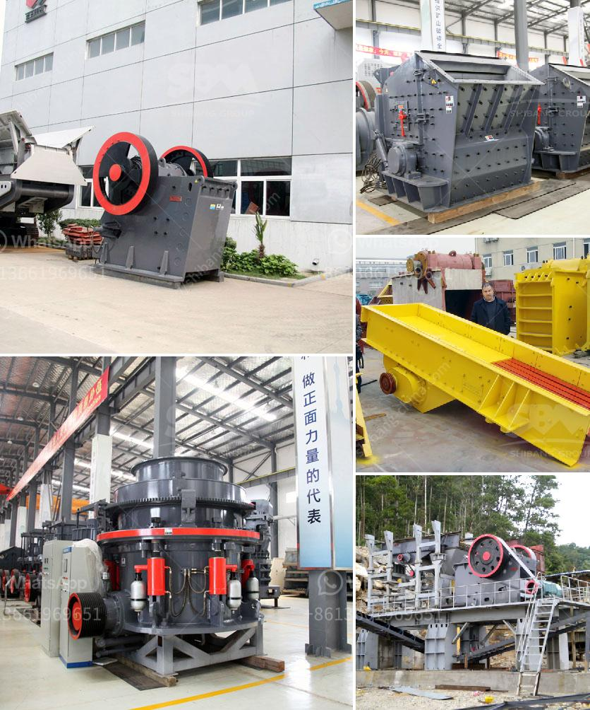

<h3>company where they sell industrial mills</h3>
In the ever-evolving world of manufacturing and production, industrial mills play a crucial role in shaping various industries. From food processing to material reduction, the performance and efficiency of these mills directly impact productivity and profits. Among the companies leading the charge in revolutionizing industrial milling is [Company Name], a game-changer in the market.

With a relentless commitment to innovation, [Company Name] has established itself as a leading provider of cutting-edge industrial mills. Incorporating state-of-the-art technology, their mills offer unparalleled precision, efficiency, and durability, making them the top choice for businesses across multiple sectors.

One of the standout features of [Company Name]'s mills is their versatility. Whether it's grinding, crushing, or pulverizing, their machines are designed to handle a wide range of materials, from feeds and grains to chemicals and minerals. This flexibility caters to diverse industries, such as agriculture, chemical processing, and mining, allowing them to enhance productivity and pave the way for profitability.

Moreover, [Company Name] provides industrial mills with varying capacities, perfectly catering to the needs and scale of different businesses. Ranging from compact mills suitable for small-scale operations to larger models for high-volume production, their product line guarantees optimal performance regardless of the size of your operation.

Understanding that one size does not fit all, [Company Name] offers customization options to meet specific industry requirements. Their team of skilled professionals collaborates closely with clients to tailor their mills and configurations, ensuring maximum output and efficiency.

Additionally, [Company Name] sets itself apart by providing exceptional customer support. With their team of experienced engineers and technicians, they offer comprehensive guidance, maintenance, and repair services, ensuring uninterrupted operation and minimizing downtime for their esteemed clientele.

In a dynamic world driven by technological advancements, [Company Name] has positioned itself as an industry frontrunner, revolutionizing industrial milling. With their cutting-edge technology, versatile machines, and unwavering commitment to customer satisfaction, they are empowering businesses across sectors to achieve new heights of productivity and success.

For industries seeking unmatched precision, efficiency, and durability in their milling processes, [Company Name] stands as the go-to choice, marking the beginning of a new era in industrial milling.
<h3>Contact us</h3><ul><li><strong>Whatsapp:&nbsp;<a href="https://wa.me/8613661969651">+8613661969651</a></strong></li><li><a href="https://swt.shibang-china.com/?git&amp;zhl&amp;company where they sell industrial mills"><strong>Online Service(chat now)</strong></a></li></ul><h3>Related</h3><ul><li><a href='cement making machines for factory.md'>cement making machines for factory</a></li><li><a href='ball mills for mining of 5000 tons per hour.md'>ball mills for mining of 5000 tons per hour</a></li><li><a href='mobile vsi crusher.md'>mobile vsi crusher</a></li><li><a href='stone crusher in germany.md'>stone crusher in germany</a></li><li><a href='iron ore beneficiation plant for sale.md'>iron ore beneficiation plant for sale</a></li></ul>