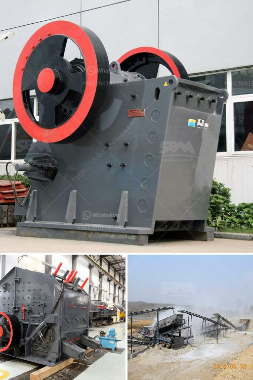

<h3>complete crushing for sale with price</h3>
In today's competitive market, companies and industries are constantly on the lookout for efficient and cost-effective solutions to meet their crushing needs. Complete crushing plants offer a turnkey solution to the crushing process, ensuring that all the necessary equipment and machinery are in place to get the job done.

A complete crushing plant typically consists of primary crushers, secondary crushers, screens, and conveyors, all designed to work together harmoniously to produce high-quality aggregates efficiently. These plants are commonly used in mining, construction, and recycling industries, where the demand for crushed materials is high.

One of the key advantages of investing in a complete crushing plant is its ability to handle a variety of materials. Whether it's hard rock, limestone, or recycled concrete, these plants can effectively crush and process them into the desired size and specifications. This versatility allows businesses to cater to different customer requirements without the need for additional equipment.

When considering purchasing a complete crushing plant, the price is an important factor to take into account. The cost of such plants may vary depending on various factors, including the size of the plant, the capacity it can handle, and the specific requirements of the customer. Typically, complete crushing plants can range anywhere from $500,000 to $2 million or more.

It is important to note that the price of a complete crushing plant includes not only the cost of the equipment but also factors such as installation, site preparation, and ongoing maintenance. Additionally, optional features, customization, and additional add-ons can further affect the overall price. Therefore, it is crucial to get detailed quotes and discuss all the necessary requirements with the supplier before making a purchase decision.

However, while price is a significant consideration, it is also essential to ensure that the quality and reliability of the equipment are not compromised. Investing in a complete crushing plant requires a substantial financial commitment, and it is crucial to choose a reputable supplier who can provide durable and efficient machinery.

Proper maintenance and timely servicing are also crucial in maximizing the lifespan and efficiency of complete crushing plants. Regular inspections and preventive maintenance can prevent costly breakdowns and ensure the smooth operation of the equipment. It is important to establish a maintenance schedule and work closely with the supplier to address any issues that may arise promptly.

In conclusion, a complete crushing plant offers a turnkey solution for the crushing needs of various industries. The price of such plants can vary depending on size, capacity, and specific requirements, ranging from $500,000 to $2 million or more. However, it is important to consider not only the price but also the quality, reliability, and ongoing maintenance requirements of the equipment. By carefully evaluating and choosing a reputable supplier, businesses can ensure the long-term success of their crushing operations.
<h3>Contact us</h3><ul><li><strong>Whatsapp:&nbsp;<a href="https://wa.me/8613661969651">+8613661969651</a></strong></li><li><a href="https://swt.shibang-china.com/?git&amp;zhl&amp;complete crushing for sale with price"><strong>Online Service(chat now)</strong></a></li></ul><h3>Related</h3><ul><li><a href='three roller mill pakistan.md'>three roller mill pakistan</a></li><li><a href='nigeria granite crushers.md'>nigeria granite crushers</a></li><li><a href='hammer mill grinder thailand.md'>hammer mill grinder thailand</a></li><li><a href='mobile crushing stone machines from austria.md'>mobile crushing stone machines from austria</a></li><li><a href='simple grinding mill type in ethiopia.md'>simple grinding mill type in ethiopia</a></li></ul>